# **⚙ Jig 생애주기 관리 프로그램 - JIG:SEE ⚙**

> Samsung Software Academy For Youth 10기  
> Samsung SDI 기업 연계 프로젝트  
> 개발 기간 : 2024.04.08 ~ 2024.05.20

<br>

# 1. 주요 기능

## 관리자 화면

### 대시보드

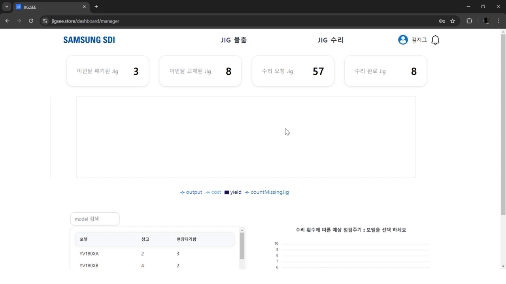

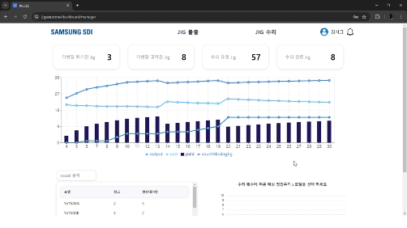

- 전체 Jig 현황, 예상 점검 주기, 점검 주기 별 생산량, 위험 지그 수를 한 눈에 파악할 수 있습니다.

<br>

### Jig 불출 요청 및 불출 승인

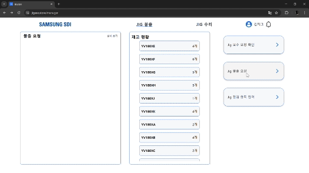

- 관리자가 직접 Jig의 불출을 요청할 수 있습니다.

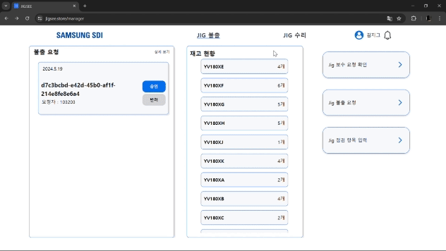

- 불출 요청된 Jig 목록을 확인하고 승인, 반려할 수 있습니다.


- 승인이나 반려된 Jig 목록을 확인할 수 있습니다.

<br>

### Work Order

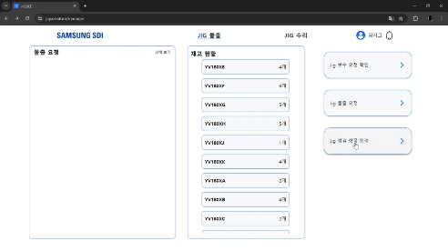

<br>

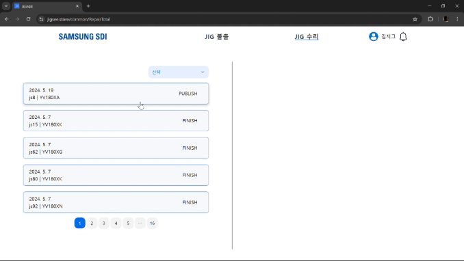

- Jig의 점검 항목을 수정할 수 있습니다.
- 수정된 점검 항목은 이후 작성되는 Work Order에 자동으로 반영됩니다.

<br>

## 기술팀 화면

### 대시보드

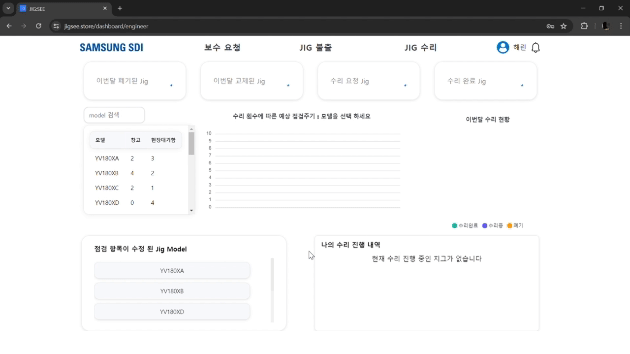
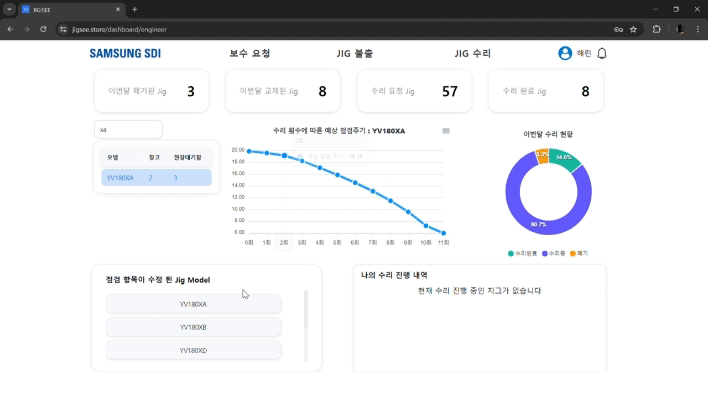

- 각 Jig의 상세 정보, 수리 현황을 한 눈에 볼 수 있습니다.

<br>

### Jig 불출 요청

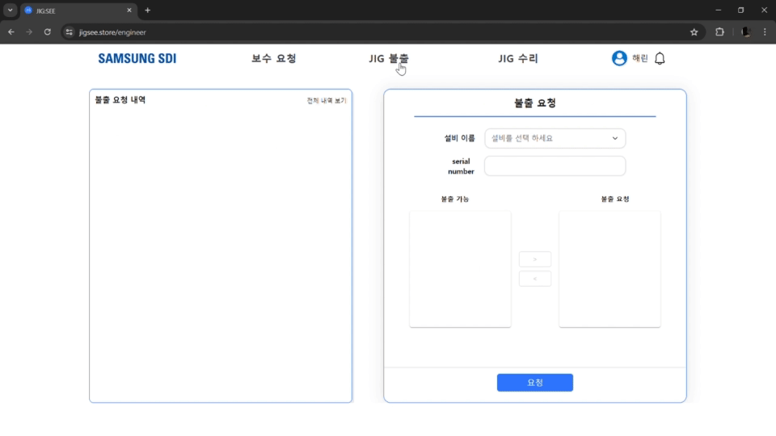

- 필요한 Jig의 불출을 요청하고 요청 내역을 확인할 수 있습니다.

<br>

### Jig 수리 내역

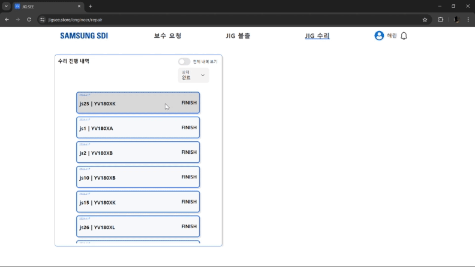

- Jig의 수리 진행 내역을 조회하고 수리가 완료된 Jig의 Work Order를 작성할 수 있습니다.

<br>

## 생산팀 App

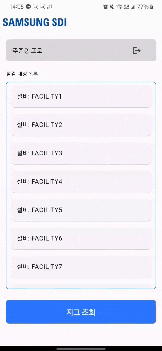
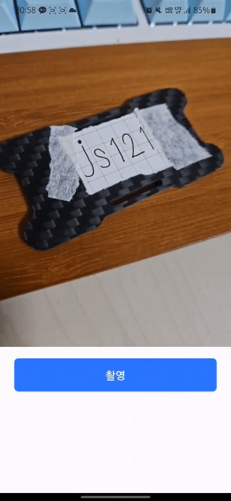

- 생산팀은 교체 주기가 된 Jig의 목록을 확인할 수 있습니다.
- 간단하게 S/N을 촬영하고 해당 Jig를 교체할 수 있습니다.
- Jig의 잘못된 투입을 방지합니다.

<br>
<br>

# 2. 프로젝트 구조

## 2-1. 기술 스택

<div align="center">
<h1>✨Front-end Stack✨</h1>


<br>


</div>

<br>

<div align="center">
<h1>✨Back-end Stack✨</h1>


<br>


<br>


</div>

<br>

<div align="center">
<h1>✨Infrastructure Stack✨</h1>


<br>


</div>

<br>

<div align="center">
<h1>✨Cooperation Tool✨</h1>


</div>

<br>

## 2-2. API 명세서

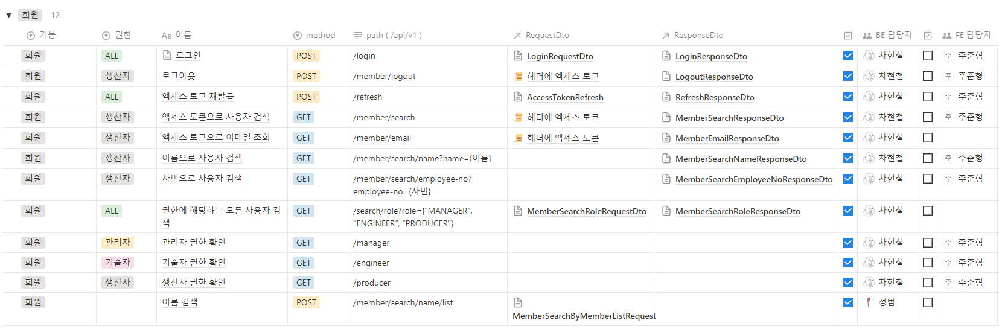

<br>

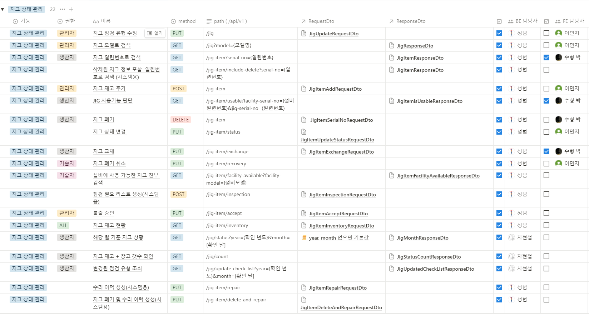
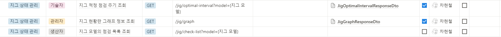

<br>

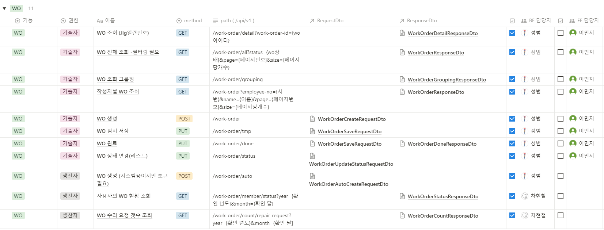
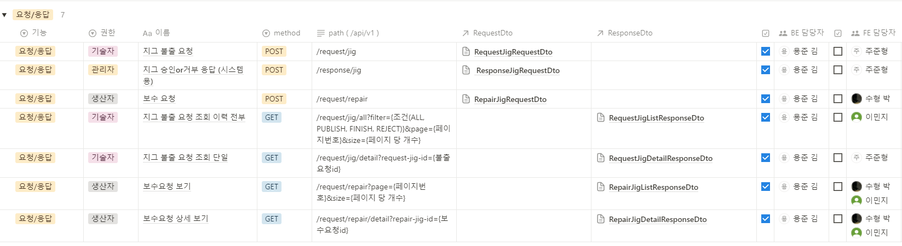

<br>

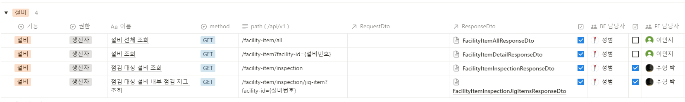

<br>

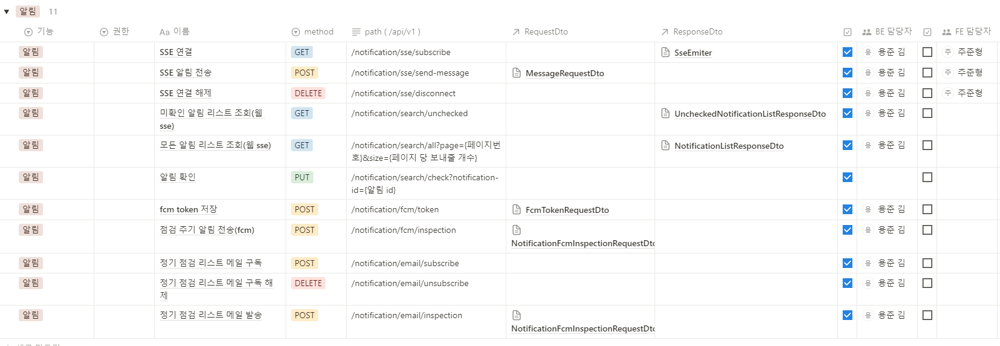

<br>

## 2-3. ERD

### MySQL

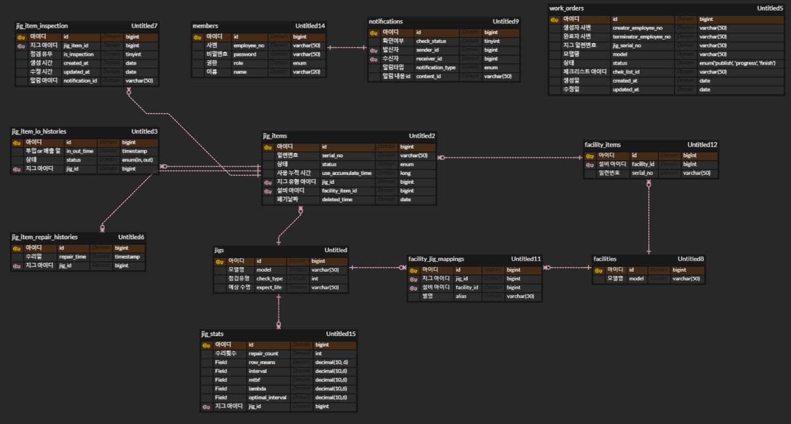

### MongoDB

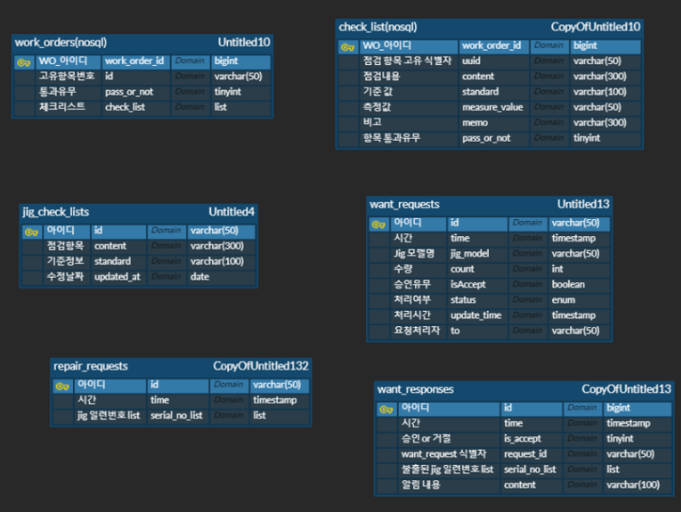

<br>

## 2-4. 시스템 아키텍처

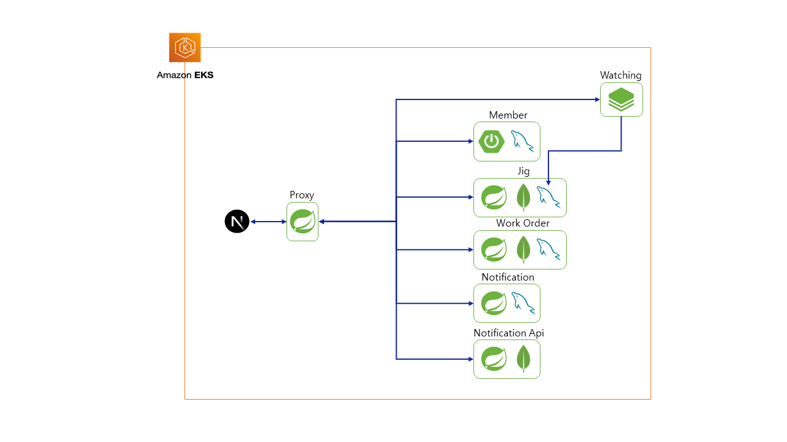

- MSA 구조로 Proxy Server가 클라이언트-서버 / 서버-서버 간의 통신을 담당

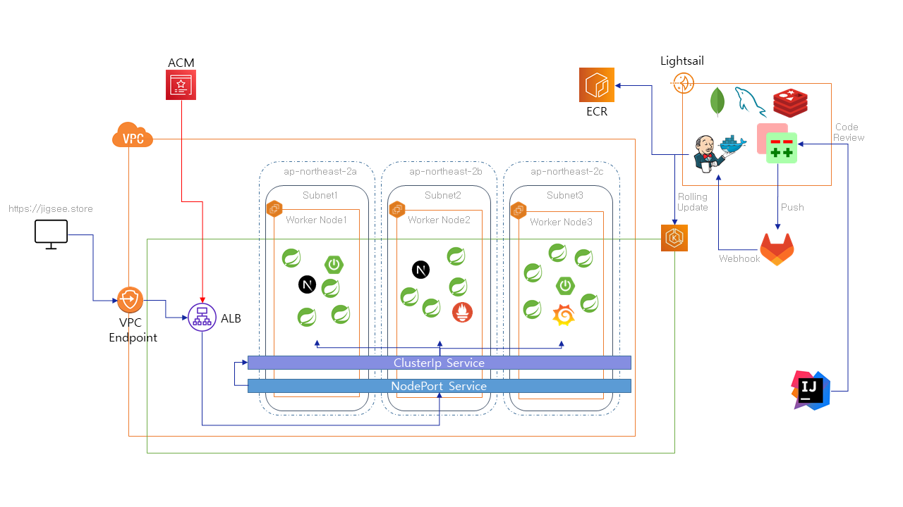

<br>

## 2-5. 화면 정의서

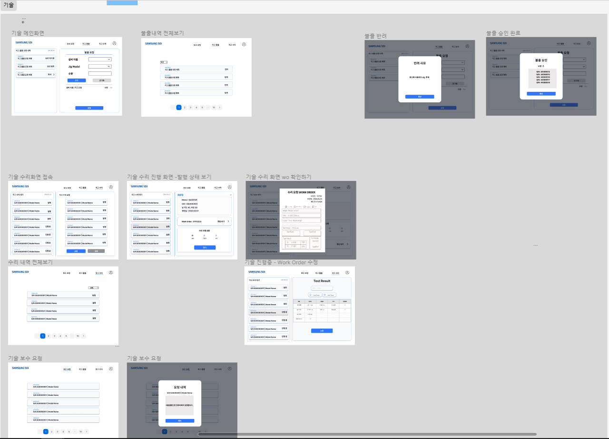
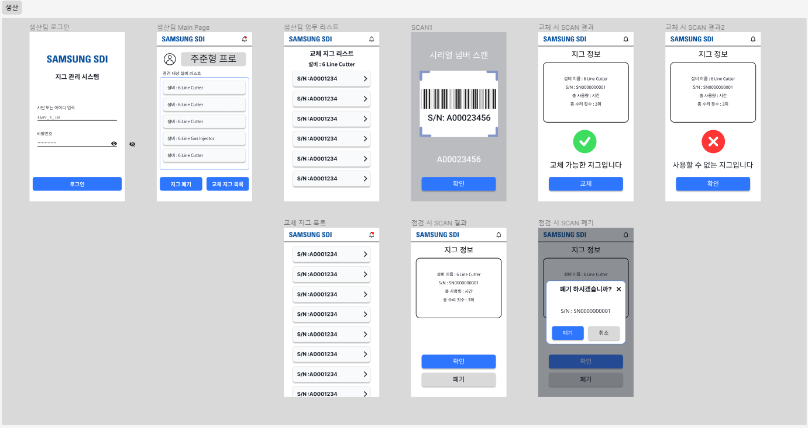
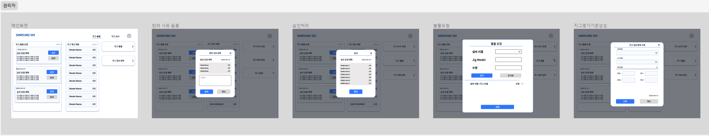
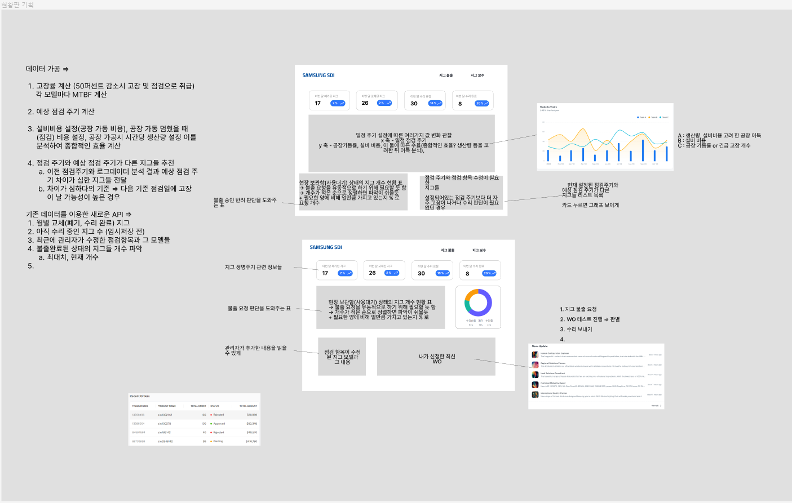

<br>

## 2-6. 디렉토리 구조

### Front-End

- Web
  ```markdown
  📦jigsee
  ┣ 📂components
  ┃ ┣ 📂dashboard
  ┃ ┃ ┣ 📜editedmethod.tsx
  ┃ ┃ ┣ 📜lifetime.tsx
  ┃ ┃ ┣ 📜managergraph.tsx
  ┃ ┃ ┣ 📜myWo.tsx
  ┃ ┃ ┣ 📜releasetable.tsx
  ┃ ┃ ┣ 📜repairdonut.tsx
  ┃ ┃ ┗ 📜report.tsx
  ┃ ┣ 📂icons
  ┃ ┃ ┗ 📜circularwithLabels.tsx
  ┃ ┣ 📂release
  ┃ ┃ ┣ 📜Approve.tsx
  ┃ ┃ ┣ 📜ApprovedRelease.tsx
  ┃ ┃ ┣ 📜EditStandard.tsx
  ┃ ┃ ┣ 📜RejectedRelease.tsx
  ┃ ┃ ┣ 📜ReleaseStatusList.tsx
  ┃ ┃ ┣ 📜Request.tsx
  ┃ ┃ ┣ 📜RequestList.tsx
  ┃ ┃ ┣ 📜Return.tsx
  ┃ ┃ ┗ 📜StockList.tsx
  ┃ ┣ 📂repair
  ┃ ┃ ┣ 📜DisposeModal.tsx
  ┃ ┃ ┣ 📜JigDetail.tsx
  ┃ ┃ ┣ 📜List.tsx
  ┃ ┃ ┣ 📜Requests.tsx
  ┃ ┃ ┣ 📜ReuseModal.tsx
  ┃ ┃ ┣ 📜stepper.tsx
  ┃ ┃ ┣ 📜TotalCardModal.tsx
  ┃ ┃ ┗ 📜WOtestresult.tsx
  ┃ ┣ 📂restore
  ┃ ┃ ┗ 📜RestoreMemo.tsx
  ┃ ┗ 📂workorder
  ┃ ┃ ┣ 📜CreateWoModal.tsx
  ┃ ┃ ┣ 📜DndWrapper.tsx
  ┃ ┃ ┣ 📜ListDnDbox.tsx
  ┃ ┃ ┗ 📜template.tsx
  ┣ 📂fonts
  ┃ ┣ 📜font.css
  ┃ ┣ 📜SamsungOne-400.woff
  ┃ ┣ 📜SamsungOne-700.woff
  ┃ ┗ 📜SamsungSharpSans-Bold.woff
  ┣ 📂pages
  ┃ ┣ 📂alarm
  ┃ ┃ ┗ 📜index.tsx
  ┃ ┣ 📂api
  ┃ ┃ ┣ 📜dashboard.ts
  ┃ ┃ ┣ 📜facilityAxios.ts
  ┃ ┃ ┣ 📜health.ts
  ┃ ┃ ┣ 📜jigAxios.ts
  ┃ ┃ ┣ 📜memberAxios.ts
  ┃ ┃ ┣ 📜releaseAxios.ts
  ┃ ┃ ┣ 📜repairAxios.ts
  ┃ ┃ ┣ 📜restoreAxios.ts
  ┃ ┃ ┣ 📜sseAxios.ts
  ┃ ┃ ┗ 📜workorderAxios.ts
  ┃ ┣ 📂common
  ┃ ┃ ┣ 📂ReleaseTotal
  ┃ ┃ ┃ ┗ 📜index.tsx
  ┃ ┃ ┣ 📂RepairTotal
  ┃ ┃ ┃ ┣ 📂MyTotal
  ┃ ┃ ┃ ┃ ┗ 📜index.tsx
  ┃ ┃ ┃ ┗ 📜index.tsx
  ┃ ┃ ┗ 📂RestoreTotal
  ┃ ┃ ┃ ┗ 📜index.tsx
  ┃ ┣ 📂dashboard
  ┃ ┃ ┣ 📜engineer.tsx
  ┃ ┃ ┣ 📜index.tsx
  ┃ ┃ ┗ 📜manager.tsx
  ┃ ┣ 📂engineer
  ┃ ┃ ┣ 📜index.tsx
  ┃ ┃ ┣ 📜navbar.tsx
  ┃ ┃ ┣ 📜repair.tsx
  ┃ ┃ ┗ 📜restore.tsx
  ┃ ┣ 📂loading
  ┃ ┃ ┗ 📜index.tsx
  ┃ ┣ 📂login
  ┃ ┃ ┗ 📜index.tsx
  ┃ ┣ 📂manager
  ┃ ┃ ┣ 📜index.tsx
  ┃ ┃ ┗ 📜navbar.tsx
  ┃ ┣ 📜index.tsx
  ┃ ┣ 📜_app.tsx
  ┃ ┗ 📜_document.tsx
  ┣ 📂public
  ┃ ┣ 📂images
  ┃ ┃ ┣ 📜account.svg
  ┃ ┃ ┣ 📜add_blue_btn.svg
  ┃ ┃ ┣ 📜bell.svg
  ┃ ┃ ┣ 📜delete_gray.svg
  ┃ ┃ ┣ 📜delete_normal.svg
  ┃ ┃ ┣ 📜icon.png
  ┃ ┃ ┣ 📜Loadinglogo.gif
  ┃ ┃ ┣ 📜profile.svg
  ┃ ┃ ┣ 📜sdi-logo-left.svg
  ┃ ┃ ┣ 📜sdi-logo.svg
  ┃ ┃ ┗ 📜userprofile.svg
  ┃ ┣ 📜favicon.ico
  ┃ ┣ 📜next.svg
  ┃ ┗ 📜vercel.svg
  ┣ 📂store
  ┃ ┣ 📜dashboardstore.ts
  ┃ ┣ 📜facilitystore.ts
  ┃ ┣ 📜jigstore.ts
  ┃ ┣ 📜memberstore.ts
  ┃ ┣ 📜releasestore.ts
  ┃ ┣ 📜repairrequeststore.ts
  ┃ ┣ 📜restorestore.ts
  ┃ ┣ 📜ssestore.ts
  ┃ ┗ 📜workorderstore.ts
  ┣ 📂styles
  ┃ ┣ 📂dashboard
  ┃ ┃ ┣ 📜editmethod.module.scss
  ┃ ┃ ┣ 📜engineer.module.scss
  ┃ ┃ ┣ 📜manager.module.scss
  ┃ ┃ ┣ 📜mywo.module.css
  ┃ ┃ ┣ 📜releasetable.module.scss
  ┃ ┃ ┗ 📜report.module.scss
  ┃ ┣ 📂modal
  ┃ ┃ ┣ 📜approvedrelease.module.css
  ┃ ┃ ┣ 📜createwo.module.css
  ┃ ┃ ┣ 📜disposeModal.module.css
  ┃ ┃ ┣ 📜rejectedrelease.module.css
  ┃ ┃ ┣ 📜releaseapprove.module.scss
  ┃ ┃ ┣ 📜releasereturn.module.css
  ┃ ┃ ┣ 📜restorerequest.module.css
  ┃ ┃ ┣ 📜reuseModal.module.css
  ┃ ┃ ┗ 📜workorder.module.css
  ┃ ┣ 📂Total
  ┃ ┃ ┣ 📜MyTotal.module.css
  ┃ ┃ ┗ 📜Total.module.css
  ┃ ┣ 📜alarm.module.scss
  ┃ ┣ 📜engineer.module.scss
  ┃ ┣ 📜globals.css
  ┃ ┣ 📜Home.module.css
  ┃ ┣ 📜jigdetail.module.css
  ┃ ┣ 📜jigrequest.module.scss
  ┃ ┣ 📜loading.module.css
  ┃ ┣ 📜login.module.scss
  ┃ ┣ 📜manager.module.scss
  ┃ ┣ 📜releasestatuslist.module.css
  ┃ ┣ 📜repairlist.module.css
  ┃ ┣ 📜repairrequest.module.css
  ┃ ┣ 📜requestlist.module.css
  ┃ ┣ 📜stocklist.module.css
  ┃ ┗ 📜wotestresult.module.scss
  ┣ 📂utils
  ┃ ┣ 📜cookie.ts
  ┃ ┣ 📜instance.ts
  ┃ ┗ 📜useDnd.ts
  ┣ 📜.dockerignore
  ┣ 📜.env.development
  ┣ 📜.env.production
  ┣ 📜.eslintrc.js
  ┣ 📜.gitignore
  ┣ 📜Dockerfile
  ┣ 📜middleware.ts
  ┣ 📜next.config.mjs
  ┣ 📜package-lock.json
  ┣ 📜package.json
  ┣ 📜postcss.config.js
  ┣ 📜README.md
  ┣ 📜tailwind.config.ts
  ┗ 📜tsconfig.json
  ```
- App
  ```markdown
  📦jigsee
  ┣ 📂.vscode
  ┃ ┗ 📜launch.json
  ┣ 📂android
  ┃ ┣ 📂app
  ┃ ┃ ┣ 📂src
  ┃ ┃ ┃ ┣ 📂debug
  ┃ ┃ ┃ ┃ ┗ 📜AndroidManifest.xml
  ┃ ┃ ┃ ┣ 📂main
  ┃ ┃ ┃ ┃ ┣ 📂kotlin
  ┃ ┃ ┃ ┃ ┃ ┗ 📂com
  ┃ ┃ ┃ ┃ ┃ ┃ ┗ 📂example
  ┃ ┃ ┃ ┃ ┃ ┃ ┃ ┗ 📂jigsee
  ┃ ┃ ┃ ┃ ┃ ┃ ┃ ┃ ┗ 📜MainActivity.kt
  ┃ ┃ ┃ ┃ ┣ 📂res
  ┃ ┃ ┃ ┃ ┃ ┣ 📂drawable
  ┃ ┃ ┃ ┃ ┃ ┃ ┗ 📜launch_background.xml
  ┃ ┃ ┃ ┃ ┃ ┣ 📂drawable-v21
  ┃ ┃ ┃ ┃ ┃ ┃ ┗ 📜launch_background.xml
  ┃ ┃ ┃ ┃ ┃ ┣ 📂mipmap-hdpi
  ┃ ┃ ┃ ┃ ┃ ┃ ┗ 📜ic_launcher.png
  ┃ ┃ ┃ ┃ ┃ ┣ 📂mipmap-mdpi
  ┃ ┃ ┃ ┃ ┃ ┃ ┗ 📜ic_launcher.png
  ┃ ┃ ┃ ┃ ┃ ┣ 📂mipmap-xhdpi
  ┃ ┃ ┃ ┃ ┃ ┃ ┗ 📜ic_launcher.png
  ┃ ┃ ┃ ┃ ┃ ┣ 📂mipmap-xxhdpi
  ┃ ┃ ┃ ┃ ┃ ┃ ┗ 📜ic_launcher.png
  ┃ ┃ ┃ ┃ ┃ ┣ 📂mipmap-xxxhdpi
  ┃ ┃ ┃ ┃ ┃ ┃ ┗ 📜ic_launcher.png
  ┃ ┃ ┃ ┃ ┃ ┣ 📂values
  ┃ ┃ ┃ ┃ ┃ ┃ ┗ 📜styles.xml
  ┃ ┃ ┃ ┃ ┃ ┗ 📂values-night
  ┃ ┃ ┃ ┃ ┃ ┃ ┗ 📜styles.xml
  ┃ ┃ ┃ ┃ ┗ 📜AndroidManifest.xml
  ┃ ┃ ┃ ┗ 📂profile
  ┃ ┃ ┃ ┃ ┗ 📜AndroidManifest.xml
  ┃ ┃ ┣ 📜build.gradle
  ┃ ┃ ┗ 📜google-services.json
  ┃ ┣ 📂gradle
  ┃ ┃ ┗ 📂wrapper
  ┃ ┃ ┃ ┗ 📜gradle-wrapper.properties
  ┃ ┣ 📜.gitignore
  ┃ ┣ 📜build.gradle
  ┃ ┣ 📜gradle.properties
  ┃ ┗ 📜settings.gradle
  ┣ 📂assets
  ┃ ┣ 📜availableMark.svg
  ┃ ┣ 📜invisible_icon.svg
  ┃ ┣ 📜notAvailableMark.svg
  ┃ ┣ 📜notification.svg
  ┃ ┣ 📜notification_alert.svg
  ┃ ┣ 📜profileIcon.svg
  ┃ ┣ 📜raiseErrorMark.svg
  ┃ ┣ 📜SDI_LOGO.png
  ┃ ┗ 📜visible_icon.svg
  ┣ 📂ios
  ┃ ┣ 📂Flutter
  ┃ ┃ ┣ 📜AppFrameworkInfo.plist
  ┃ ┃ ┣ 📜Debug.xcconfig
  ┃ ┃ ┗ 📜Release.xcconfig
  ┃ ┣ 📂Runner
  ┃ ┃ ┣ 📂Assets.xcassets
  ┃ ┃ ┃ ┣ 📂AppIcon.appiconset
  ┃ ┃ ┃ ┃ ┣ 📜Contents.json
  ┃ ┃ ┃ ┃ ┣ 📜Icon-App-1024x1024@1x.png
  ┃ ┃ ┃ ┃ ┣ 📜Icon-App-20x20@1x.png
  ┃ ┃ ┃ ┃ ┣ 📜Icon-App-20x20@2x.png
  ┃ ┃ ┃ ┃ ┣ 📜Icon-App-20x20@3x.png
  ┃ ┃ ┃ ┃ ┣ 📜Icon-App-29x29@1x.png
  ┃ ┃ ┃ ┃ ┣ 📜Icon-App-29x29@2x.png
  ┃ ┃ ┃ ┃ ┣ 📜Icon-App-29x29@3x.png
  ┃ ┃ ┃ ┃ ┣ 📜Icon-App-40x40@1x.png
  ┃ ┃ ┃ ┃ ┣ 📜Icon-App-40x40@2x.png
  ┃ ┃ ┃ ┃ ┣ 📜Icon-App-40x40@3x.png
  ┃ ┃ ┃ ┃ ┣ 📜Icon-App-60x60@2x.png
  ┃ ┃ ┃ ┃ ┣ 📜Icon-App-60x60@3x.png
  ┃ ┃ ┃ ┃ ┣ 📜Icon-App-76x76@1x.png
  ┃ ┃ ┃ ┃ ┣ 📜Icon-App-76x76@2x.png
  ┃ ┃ ┃ ┃ ┗ 📜Icon-App-83.5x83.5@2x.png
  ┃ ┃ ┃ ┗ 📂LaunchImage.imageset
  ┃ ┃ ┃ ┃ ┣ 📜Contents.json
  ┃ ┃ ┃ ┃ ┣ 📜LaunchImage.png
  ┃ ┃ ┃ ┃ ┣ 📜LaunchImage@2x.png
  ┃ ┃ ┃ ┃ ┣ 📜LaunchImage@3x.png
  ┃ ┃ ┃ ┃ ┗ 📜README.md
  ┃ ┃ ┣ 📂Base.lproj
  ┃ ┃ ┃ ┣ 📜LaunchScreen.storyboard
  ┃ ┃ ┃ ┗ 📜Main.storyboard
  ┃ ┃ ┣ 📜AppDelegate.swift
  ┃ ┃ ┣ 📜Info.plist
  ┃ ┃ ┗ 📜Runner-Bridging-Header.h
  ┃ ┣ 📂Runner.xcodeproj
  ┃ ┃ ┣ 📂project.xcworkspace
  ┃ ┃ ┃ ┣ 📂xcshareddata
  ┃ ┃ ┃ ┃ ┣ 📜IDEWorkspaceChecks.plist
  ┃ ┃ ┃ ┃ ┗ 📜WorkspaceSettings.xcsettings
  ┃ ┃ ┃ ┗ 📜contents.xcworkspacedata
  ┃ ┃ ┣ 📂xcshareddata
  ┃ ┃ ┃ ┗ 📂xcschemes
  ┃ ┃ ┃ ┃ ┗ 📜Runner.xcscheme
  ┃ ┃ ┗ 📜project.pbxproj
  ┃ ┣ 📂Runner.xcworkspace
  ┃ ┃ ┣ 📂xcshareddata
  ┃ ┃ ┃ ┣ 📜IDEWorkspaceChecks.plist
  ┃ ┃ ┃ ┗ 📜WorkspaceSettings.xcsettings
  ┃ ┃ ┗ 📜contents.xcworkspacedata
  ┃ ┗ 📜.gitignore
  ┣ 📂lib
  ┃ ┣ 📂api
  ┃ ┃ ┣ 📜dio_instance.dart
  ┃ ┃ ┣ 📜provider.dart
  ┃ ┃ ┗ 📜user_auth.dart
  ┃ ┣ 📂components
  ┃ ┃ ┣ 📜custom_form.dart
  ┃ ┃ ┣ 📜custom_text_form_field.dart
  ┃ ┃ ┣ 📜header.dart
  ┃ ┃ ┗ 📜navigate_animation.dart
  ┃ ┣ 📂consts
  ┃ ┃ ┣ 📜constants.dart
  ┃ ┃ ┗ 📜size.dart
  ┃ ┣ 📂pages
  ┃ ┃ ┣ 📜abrogate_jig.dart
  ┃ ┃ ┣ 📜home_page.dart
  ┃ ┃ ┣ 📜login_page.dart
  ┃ ┃ ┣ 📜ocr_page.dart
  ┃ ┃ ┗ 📜spe_jig_list.dart
  ┃ ┣ 📂stores
  ┃ ┃ ┗ 📜usePreference.dart
  ┃ ┣ 📜firebase_options.dart
  ┃ ┗ 📜main.dart
  ┣ 📂test
  ┃ ┗ 📜widget_test.dart
  ┣ 📂web
  ┃ ┣ 📂icons
  ┃ ┃ ┣ 📜Icon-192.png
  ┃ ┃ ┣ 📜Icon-512.png
  ┃ ┃ ┣ 📜Icon-maskable-192.png
  ┃ ┃ ┗ 📜Icon-maskable-512.png
  ┃ ┣ 📜favicon.png
  ┃ ┣ 📜index.html
  ┃ ┗ 📜manifest.json
  ┣ 📂windows
  ┃ ┣ 📂flutter
  ┃ ┃ ┣ 📜CMakeLists.txt
  ┃ ┃ ┣ 📜generated_plugins.cmake
  ┃ ┃ ┣ 📜generated_plugin_registrant.cc
  ┃ ┃ ┗ 📜generated_plugin_registrant.h
  ┃ ┣ 📂runner
  ┃ ┃ ┣ 📂resources
  ┃ ┃ ┃ ┗ 📜app_icon.ico
  ┃ ┃ ┣ 📜CMakeLists.txt
  ┃ ┃ ┣ 📜flutter_window.cpp
  ┃ ┃ ┣ 📜flutter_window.h
  ┃ ┃ ┣ 📜main.cpp
  ┃ ┃ ┣ 📜resource.h
  ┃ ┃ ┣ 📜runner.exe.manifest
  ┃ ┃ ┣ 📜Runner.rc
  ┃ ┃ ┣ 📜utils.cpp
  ┃ ┃ ┣ 📜utils.h
  ┃ ┃ ┣ 📜win32_window.cpp
  ┃ ┃ ┗ 📜win32_window.h
  ┃ ┣ 📜.gitignore
  ┃ ┗ 📜CMakeLists.txt
  ┣ 📜.gitignore
  ┣ 📜.metadata
  ┣ 📜analysis_options.yaml
  ┣ 📜firebase.json
  ┣ 📜pubspec.lock
  ┣ 📜pubspec.yaml
  ┗ 📜README.md
  ```

### Back-End

- API
  ```markdown
  📦api-server
  ┣ 📂.idea
  ┃ ┗ 📜.gitignore
  ┣ 📂gradle
  ┃ ┗ 📂wrapper
  ┃ ┃ ┣ 📜gradle-wrapper.jar
  ┃ ┃ ┗ 📜gradle-wrapper.properties
  ┣ 📂src
  ┃ ┣ 📂main
  ┃ ┃ ┣ 📂java
  ┃ ┃ ┃ ┗ 📂com
  ┃ ┃ ┃ ┃ ┗ 📂sdi
  ┃ ┃ ┃ ┃ ┃ ┗ 📂apiserver
  ┃ ┃ ┃ ┃ ┃ ┃ ┣ 📂api
  ┃ ┃ ┃ ┃ ┃ ┃ ┃ ┣ 📂facility
  ┃ ┃ ┃ ┃ ┃ ┃ ┃ ┃ ┣ 📂client
  ┃ ┃ ┃ ┃ ┃ ┃ ┃ ┃ ┃ ┗ 📜FacilityItemClient.java
  ┃ ┃ ┃ ┃ ┃ ┃ ┃ ┃ ┣ 📂dto
  ┃ ┃ ┃ ┃ ┃ ┃ ┃ ┃ ┃ ┣ 📂request
  ┃ ┃ ┃ ┃ ┃ ┃ ┃ ┃ ┃ ┃ ┗ 📜FacilityCreateRequestDto.java
  ┃ ┃ ┃ ┃ ┃ ┃ ┃ ┃ ┃ ┗ 📂response
  ┃ ┃ ┃ ┃ ┃ ┃ ┃ ┃ ┃ ┃ ┣ 📜FacilityAllResponseDto.java
  ┃ ┃ ┃ ┃ ┃ ┃ ┃ ┃ ┃ ┃ ┣ 📜FacilityDetailResponseDto.java
  ┃ ┃ ┃ ┃ ┃ ┃ ┃ ┃ ┃ ┃ ┣ 📜FacilityItemInspectionJigItemsResponseDto.java
  ┃ ┃ ┃ ┃ ┃ ┃ ┃ ┃ ┃ ┃ ┗ 📜FacilityItemInspectionResponseDto.java
  ┃ ┃ ┃ ┃ ┃ ┃ ┃ ┃ ┗ 📜FacilityController.java
  ┃ ┃ ┃ ┃ ┃ ┃ ┃ ┣ 📂jig
  ┃ ┃ ┃ ┃ ┃ ┃ ┃ ┃ ┣ 📂client
  ┃ ┃ ┃ ┃ ┃ ┃ ┃ ┃ ┃ ┣ 📜JigClient.java
  ┃ ┃ ┃ ┃ ┃ ┃ ┃ ┃ ┃ ┗ 📜JigItemClient.java
  ┃ ┃ ┃ ┃ ┃ ┃ ┃ ┃ ┣ 📂dto
  ┃ ┃ ┃ ┃ ┃ ┃ ┃ ┃ ┃ ┣ 📂request
  ┃ ┃ ┃ ┃ ┃ ┃ ┃ ┃ ┃ ┃ ┣ 📜JigItemAcceptRequestDto.java
  ┃ ┃ ┃ ┃ ┃ ┃ ┃ ┃ ┃ ┃ ┣ 📜JigItemAddRequestDto.java
  ┃ ┃ ┃ ┃ ┃ ┃ ┃ ┃ ┃ ┃ ┣ 📜JigItemDeleteAndRepairRequestDto.java
  ┃ ┃ ┃ ┃ ┃ ┃ ┃ ┃ ┃ ┃ ┣ 📜JigItemExchangeRequestDto.java
  ┃ ┃ ┃ ┃ ┃ ┃ ┃ ┃ ┃ ┃ ┣ 📜JigItemInspectionRequestDto.java
  ┃ ┃ ┃ ┃ ┃ ┃ ┃ ┃ ┃ ┃ ┣ 📜JigItemRepairRequestDto.java
  ┃ ┃ ┃ ┃ ┃ ┃ ┃ ┃ ┃ ┃ ┣ 📜JigItemSerialNoRequestDto.java
  ┃ ┃ ┃ ┃ ┃ ┃ ┃ ┃ ┃ ┃ ┣ 📜JigItemUpdateStatusRequestDto.java
  ┃ ┃ ┃ ┃ ┃ ┃ ┃ ┃ ┃ ┃ ┗ 📜JigUpdateRequestDto.java
  ┃ ┃ ┃ ┃ ┃ ┃ ┃ ┃ ┃ ┣ 📂response
  ┃ ┃ ┃ ┃ ┃ ┃ ┃ ┃ ┃ ┃ ┣ 📜JigGraphResponseDto.java
  ┃ ┃ ┃ ┃ ┃ ┃ ┃ ┃ ┃ ┃ ┣ 📜JigItemFacilityAvailableResponseDto.java
  ┃ ┃ ┃ ┃ ┃ ┃ ┃ ┃ ┃ ┃ ┣ 📜JigItemInventoryRequestDto.java
  ┃ ┃ ┃ ┃ ┃ ┃ ┃ ┃ ┃ ┃ ┣ 📜JigItemIsUsableResponseDto.java
  ┃ ┃ ┃ ┃ ┃ ┃ ┃ ┃ ┃ ┃ ┣ 📜JigItemResponseDto.java
  ┃ ┃ ┃ ┃ ┃ ┃ ┃ ┃ ┃ ┃ ┣ 📜JigModelCountResponseDto.java
  ┃ ┃ ┃ ┃ ┃ ┃ ┃ ┃ ┃ ┃ ┣ 📜JigMonthResponseDto.java
  ┃ ┃ ┃ ┃ ┃ ┃ ┃ ┃ ┃ ┃ ┣ 📜JigOptimalIntervalResponseDto.java
  ┃ ┃ ┃ ┃ ┃ ┃ ┃ ┃ ┃ ┃ ┣ 📜JigResponseDto.java
  ┃ ┃ ┃ ┃ ┃ ┃ ┃ ┃ ┃ ┃ ┗ 📜JigUpdatedCheckListResponseDto.java
  ┃ ┃ ┃ ┃ ┃ ┃ ┃ ┃ ┃ ┗ 📂util
  ┃ ┃ ┃ ┃ ┃ ┃ ┃ ┃ ┃ ┃ ┗ 📜JigStatus.java
  ┃ ┃ ┃ ┃ ┃ ┃ ┃ ┃ ┣ 📜JigController.java
  ┃ ┃ ┃ ┃ ┃ ┃ ┃ ┃ ┗ 📜JigItemController.java
  ┃ ┃ ┃ ┃ ┃ ┃ ┃ ┣ 📂member
  ┃ ┃ ┃ ┃ ┃ ┃ ┃ ┃ ┣ 📂client
  ┃ ┃ ┃ ┃ ┃ ┃ ┃ ┃ ┃ ┗ 📜MemberClient.java
  ┃ ┃ ┃ ┃ ┃ ┃ ┃ ┃ ┣ 📂dto
  ┃ ┃ ┃ ┃ ┃ ┃ ┃ ┃ ┃ ┣ 📂request
  ┃ ┃ ┃ ┃ ┃ ┃ ┃ ┃ ┃ ┃ ┣ 📜LoginRequestDto.java
  ┃ ┃ ┃ ┃ ┃ ┃ ┃ ┃ ┃ ┃ ┗ 📜MemberSearchByMemberListRequestDto.java
  ┃ ┃ ┃ ┃ ┃ ┃ ┃ ┃ ┃ ┗ 📂response
  ┃ ┃ ┃ ┃ ┃ ┃ ┃ ┃ ┃ ┃ ┣ 📜LoginResponseDto.java
  ┃ ┃ ┃ ┃ ┃ ┃ ┃ ┃ ┃ ┃ ┣ 📜LogoutResponseDto.java
  ┃ ┃ ┃ ┃ ┃ ┃ ┃ ┃ ┃ ┃ ┣ 📜MemberEmailResponseDto.java
  ┃ ┃ ┃ ┃ ┃ ┃ ┃ ┃ ┃ ┃ ┗ 📜MemberResponseDto.java
  ┃ ┃ ┃ ┃ ┃ ┃ ┃ ┃ ┗ 📜MemberController.java
  ┃ ┃ ┃ ┃ ┃ ┃ ┃ ┣ 📂notification
  ┃ ┃ ┃ ┃ ┃ ┃ ┃ ┃ ┣ 📂client
  ┃ ┃ ┃ ┃ ┃ ┃ ┃ ┃ ┃ ┗ 📜NotificationClient.java
  ┃ ┃ ┃ ┃ ┃ ┃ ┃ ┃ ┣ 📂dto
  ┃ ┃ ┃ ┃ ┃ ┃ ┃ ┃ ┃ ┣ 📂request
  ┃ ┃ ┃ ┃ ┃ ┃ ┃ ┃ ┃ ┃ ┣ 📜FcmTokenRequestDto.java
  ┃ ┃ ┃ ┃ ┃ ┃ ┃ ┃ ┃ ┃ ┣ 📜MessageRequestDto.java
  ┃ ┃ ┃ ┃ ┃ ┃ ┃ ┃ ┃ ┃ ┗ 📜NotificationFcmInspectionRequestDto.java
  ┃ ┃ ┃ ┃ ┃ ┃ ┃ ┃ ┃ ┣ 📂response
  ┃ ┃ ┃ ┃ ┃ ┃ ┃ ┃ ┃ ┃ ┣ 📜NotificationListResponseDto.java
  ┃ ┃ ┃ ┃ ┃ ┃ ┃ ┃ ┃ ┃ ┗ 📜UncheckedNotificationListResponseDto.java
  ┃ ┃ ┃ ┃ ┃ ┃ ┃ ┃ ┃ ┗ 📜NotificationDto.java
  ┃ ┃ ┃ ┃ ┃ ┃ ┃ ┃ ┣ 📜EmailController.java
  ┃ ┃ ┃ ┃ ┃ ┃ ┃ ┃ ┣ 📜FcmController.java
  ┃ ┃ ┃ ┃ ┃ ┃ ┃ ┃ ┣ 📜SearchController.java
  ┃ ┃ ┃ ┃ ┃ ┃ ┃ ┃ ┗ 📜SseController.java
  ┃ ┃ ┃ ┃ ┃ ┃ ┃ ┣ 📂request_response
  ┃ ┃ ┃ ┃ ┃ ┃ ┃ ┃ ┣ 📂client
  ┃ ┃ ┃ ┃ ┃ ┃ ┃ ┃ ┃ ┗ 📜NotificationApiClient.java
  ┃ ┃ ┃ ┃ ┃ ┃ ┃ ┃ ┣ 📂dto
  ┃ ┃ ┃ ┃ ┃ ┃ ┃ ┃ ┃ ┣ 📂request
  ┃ ┃ ┃ ┃ ┃ ┃ ┃ ┃ ┃ ┃ ┣ 📜RepairJigRequestDto.java
  ┃ ┃ ┃ ┃ ┃ ┃ ┃ ┃ ┃ ┃ ┣ 📜RequestJigRequestDto.java
  ┃ ┃ ┃ ┃ ┃ ┃ ┃ ┃ ┃ ┃ ┗ 📜ResponseJigRequestDto.java
  ┃ ┃ ┃ ┃ ┃ ┃ ┃ ┃ ┃ ┗ 📂response
  ┃ ┃ ┃ ┃ ┃ ┃ ┃ ┃ ┃ ┃ ┣ 📜RepairJigDetailResponseDto.java
  ┃ ┃ ┃ ┃ ┃ ┃ ┃ ┃ ┃ ┃ ┣ 📜RepairJigListResponseDto.java
  ┃ ┃ ┃ ┃ ┃ ┃ ┃ ┃ ┃ ┃ ┣ 📜RequestJigDetailResponseDto.java
  ┃ ┃ ┃ ┃ ┃ ┃ ┃ ┃ ┃ ┃ ┗ 📜RequestJigListResponseDto.java
  ┃ ┃ ┃ ┃ ┃ ┃ ┃ ┃ ┣ 📜RequestController.java
  ┃ ┃ ┃ ┃ ┃ ┃ ┃ ┃ ┗ 📜ResponseController.java
  ┃ ┃ ┃ ┃ ┃ ┃ ┃ ┣ 📂wo
  ┃ ┃ ┃ ┃ ┃ ┃ ┃ ┃ ┣ 📂client
  ┃ ┃ ┃ ┃ ┃ ┃ ┃ ┃ ┃ ┗ 📜WorkOrderClient.java
  ┃ ┃ ┃ ┃ ┃ ┃ ┃ ┃ ┣ 📂dto
  ┃ ┃ ┃ ┃ ┃ ┃ ┃ ┃ ┃ ┣ 📂request
  ┃ ┃ ┃ ┃ ┃ ┃ ┃ ┃ ┃ ┃ ┣ 📜WorkOrderAutoCreateRequestDto.java
  ┃ ┃ ┃ ┃ ┃ ┃ ┃ ┃ ┃ ┃ ┣ 📜WorkOrderCreateRequest.java
  ┃ ┃ ┃ ┃ ┃ ┃ ┃ ┃ ┃ ┃ ┣ 📜WorkOrderDoneRequestDto.java
  ┃ ┃ ┃ ┃ ┃ ┃ ┃ ┃ ┃ ┃ ┣ 📜WorkOrderUpdateRequestDto.java
  ┃ ┃ ┃ ┃ ┃ ┃ ┃ ┃ ┃ ┃ ┗ 📜WorkOrderUpdateStatusRequestDto.java
  ┃ ┃ ┃ ┃ ┃ ┃ ┃ ┃ ┃ ┗ 📂response
  ┃ ┃ ┃ ┃ ┃ ┃ ┃ ┃ ┃ ┃ ┣ 📂util
  ┃ ┃ ┃ ┃ ┃ ┃ ┃ ┃ ┃ ┃ ┃ ┗ 📜WorkOrderSummary.java
  ┃ ┃ ┃ ┃ ┃ ┃ ┃ ┃ ┃ ┃ ┣ 📜WorkOrderCountResponseDto.java
  ┃ ┃ ┃ ┃ ┃ ┃ ┃ ┃ ┃ ┃ ┣ 📜WorkOrderDetailResponseDto.java
  ┃ ┃ ┃ ┃ ┃ ┃ ┃ ┃ ┃ ┃ ┣ 📜WorkOrderDoneResponseDto.java
  ┃ ┃ ┃ ┃ ┃ ┃ ┃ ┃ ┃ ┃ ┣ 📜WorkOrderGroupingResponseDto.java
  ┃ ┃ ┃ ┃ ┃ ┃ ┃ ┃ ┃ ┃ ┣ 📜WorkOrderResponseDto.java
  ┃ ┃ ┃ ┃ ┃ ┃ ┃ ┃ ┃ ┃ ┗ 📜WorkOrderStatusResponseDto.java
  ┃ ┃ ┃ ┃ ┃ ┃ ┃ ┃ ┗ 📜WorkOrderController.java
  ┃ ┃ ┃ ┃ ┃ ┃ ┃ ┗ 📜HealthController.java
  ┃ ┃ ┃ ┃ ┃ ┃ ┣ 📂config
  ┃ ┃ ┃ ┃ ┃ ┃ ┃ ┣ 📜CorsConfig.java
  ┃ ┃ ┃ ┃ ┃ ┃ ┃ ┣ 📜OpenFeignConfig.java
  ┃ ┃ ┃ ┃ ┃ ┃ ┃ ┗ 📜SwaggerConfig.java
  ┃ ┃ ┃ ┃ ┃ ┃ ┣ 📂util
  ┃ ┃ ┃ ┃ ┃ ┃ ┃ ┣ 📂mattermost
  ┃ ┃ ┃ ┃ ┃ ┃ ┃ ┃ ┣ 📜MattermostClient.java
  ┃ ┃ ┃ ┃ ┃ ┃ ┃ ┃ ┣ 📜MatterMostMessageDto.java
  ┃ ┃ ┃ ┃ ┃ ┃ ┃ ┃ ┣ 📜MattermostProperties.java
  ┃ ┃ ┃ ┃ ┃ ┃ ┃ ┃ ┣ 📜MatterMostSender.java
  ┃ ┃ ┃ ┃ ┃ ┃ ┃ ┃ ┗ 📜NotificationManager.java
  ┃ ┃ ┃ ┃ ┃ ┃ ┃ ┣ 📜CheckItem.java
  ┃ ┃ ┃ ┃ ┃ ┃ ┃ ┣ 📜CommonException.java
  ┃ ┃ ┃ ┃ ┃ ┃ ┃ ┣ 📜ErrorCode.java
  ┃ ┃ ┃ ┃ ┃ ┃ ┃ ┣ 📜GlobalControllerAdvice.java
  ┃ ┃ ┃ ┃ ┃ ┃ ┃ ┣ 📜HandleFeignResponse.java
  ┃ ┃ ┃ ┃ ┃ ┃ ┃ ┣ 📜HeaderUtils.java
  ┃ ┃ ┃ ┃ ┃ ┃ ┃ ┣ 📜JigRequestStatus.java
  ┃ ┃ ┃ ┃ ┃ ┃ ┃ ┣ 📜NotificationStatus.java
  ┃ ┃ ┃ ┃ ┃ ┃ ┃ ┣ 📜RequestJigCount.java
  ┃ ┃ ┃ ┃ ┃ ┃ ┃ ┣ 📜Response.java
  ┃ ┃ ┃ ┃ ┃ ┃ ┃ ┗ 📜WorkOrderCheckItem.java
  ┃ ┃ ┃ ┃ ┃ ┃ ┗ 📜ApiServerApplication.java
  ┃ ┃ ┗ 📂resources
  ┃ ┃ ┃ ┗ 📜application.yml
  ┃ ┗ 📂test
  ┃ ┃ ┗ 📂java
  ┃ ┃ ┃ ┗ 📂com
  ┃ ┃ ┃ ┃ ┗ 📂sdi
  ┃ ┃ ┃ ┃ ┃ ┗ 📂apiserver
  ┃ ┃ ┃ ┃ ┃ ┃ ┗ 📜ApiServerApplicationTests.java
  ┣ 📜.gitignore
  ┣ 📜build.gradle
  ┣ 📜Dockerfile
  ┣ 📜gradlew
  ┣ 📜gradlew.bat
  ┗ 📜settings.gradle
  ```
- Jig
  ```markdown
  📦jig
  ┣ 📂gradle
  ┃ ┗ 📂wrapper
  ┃ ┃ ┣ 📜gradle-wrapper.jar
  ┃ ┃ ┗ 📜gradle-wrapper.properties
  ┣ 📂src
  ┃ ┣ 📂main
  ┃ ┃ ┣ 📂java
  ┃ ┃ ┃ ┗ 📂com
  ┃ ┃ ┃ ┃ ┗ 📂sdi
  ┃ ┃ ┃ ┃ ┃ ┗ 📂jig
  ┃ ┃ ┃ ┃ ┃ ┃ ┣ 📂api
  ┃ ┃ ┃ ┃ ┃ ┃ ┃ ┣ 📜FacilityItemController.java
  ┃ ┃ ┃ ┃ ┃ ┃ ┃ ┣ 📜HealthController.java
  ┃ ┃ ┃ ┃ ┃ ┃ ┃ ┣ 📜JigController.java
  ┃ ┃ ┃ ┃ ┃ ┃ ┃ ┗ 📜JigItemController.java
  ┃ ┃ ┃ ┃ ┃ ┃ ┣ 📂application
  ┃ ┃ ┃ ┃ ┃ ┃ ┃ ┣ 📜FacilityItemService.java
  ┃ ┃ ┃ ┃ ┃ ┃ ┃ ┣ 📜JigItemService.java
  ┃ ┃ ┃ ┃ ┃ ┃ ┃ ┗ 📜JigService.java
  ┃ ┃ ┃ ┃ ┃ ┃ ┣ 📂client
  ┃ ┃ ┃ ┃ ┃ ┃ ┃ ┣ 📜NotificationApiClient.java
  ┃ ┃ ┃ ┃ ┃ ┃ ┃ ┣ 📜NotificationClient.java
  ┃ ┃ ┃ ┃ ┃ ┃ ┃ ┗ 📜WorkOrderClient.java
  ┃ ┃ ┃ ┃ ┃ ┃ ┣ 📂dto
  ┃ ┃ ┃ ┃ ┃ ┃ ┃ ┣ 📂request
  ┃ ┃ ┃ ┃ ┃ ┃ ┃ ┃ ┣ 📜JigItemAcceptRequestDto.java
  ┃ ┃ ┃ ┃ ┃ ┃ ┃ ┃ ┣ 📜JigItemAddRequestDto.java
  ┃ ┃ ┃ ┃ ┃ ┃ ┃ ┃ ┣ 📜JigItemDeleteAndRepairRequestDto.java
  ┃ ┃ ┃ ┃ ┃ ┃ ┃ ┃ ┣ 📜JigItemExchangeRequestDto.java
  ┃ ┃ ┃ ┃ ┃ ┃ ┃ ┃ ┣ 📜JigItemInspectionRequestDto.java
  ┃ ┃ ┃ ┃ ┃ ┃ ┃ ┃ ┣ 📜JigItemInventoryRequestDto.java
  ┃ ┃ ┃ ┃ ┃ ┃ ┃ ┃ ┣ 📜JigItemRepairRequestDto.java
  ┃ ┃ ┃ ┃ ┃ ┃ ┃ ┃ ┣ 📜JigItemSerialNoRequestDto.java
  ┃ ┃ ┃ ┃ ┃ ┃ ┃ ┃ ┣ 📜JigItemUpdateStatusRequestDto.java
  ┃ ┃ ┃ ┃ ┃ ┃ ┃ ┃ ┣ 📜JigUpdateRequestDto.java
  ┃ ┃ ┃ ┃ ┃ ┃ ┃ ┃ ┣ 📜NotificationFcmInspectionRequestDto.java
  ┃ ┃ ┃ ┃ ┃ ┃ ┃ ┃ ┗ 📜WorkOrderAutoCreateRequestDto.java
  ┃ ┃ ┃ ┃ ┃ ┃ ┃ ┣ 📂response
  ┃ ┃ ┃ ┃ ┃ ┃ ┃ ┃ ┣ 📜FacilityItemAllResponseDto.java
  ┃ ┃ ┃ ┃ ┃ ┃ ┃ ┃ ┣ 📜FacilityItemDetailResponseDto.java
  ┃ ┃ ┃ ┃ ┃ ┃ ┃ ┃ ┣ 📜FacilityItemInspectionJigItemsResponseDto.java
  ┃ ┃ ┃ ┃ ┃ ┃ ┃ ┃ ┣ 📜FacilityItemNeedToInspectionResponseDto.java
  ┃ ┃ ┃ ┃ ┃ ┃ ┃ ┃ ┣ 📜JigGraphResponseDto.java
  ┃ ┃ ┃ ┃ ┃ ┃ ┃ ┃ ┣ 📜JigItemFacilityAvailableResponseDto.java
  ┃ ┃ ┃ ┃ ┃ ┃ ┃ ┃ ┣ 📜JigItemIsUsableResponseDto.java
  ┃ ┃ ┃ ┃ ┃ ┃ ┃ ┃ ┣ 📜JigItemResponseDto.java
  ┃ ┃ ┃ ┃ ┃ ┃ ┃ ┃ ┣ 📜JigModelCountResponseDto.java
  ┃ ┃ ┃ ┃ ┃ ┃ ┃ ┃ ┣ 📜JigMonthResponseDto.java
  ┃ ┃ ┃ ┃ ┃ ┃ ┃ ┃ ┣ 📜JigOptimalIntervalResponseDto.java
  ┃ ┃ ┃ ┃ ┃ ┃ ┃ ┃ ┣ 📜JigResponseDto.java
  ┃ ┃ ┃ ┃ ┃ ┃ ┃ ┃ ┣ 📜JigUpdatedCheckListResponseDto.java
  ┃ ┃ ┃ ┃ ┃ ┃ ┃ ┃ ┣ 📜RequestCountRepairResponseDto.java
  ┃ ┃ ┃ ┃ ┃ ┃ ┃ ┃ ┗ 📜WorkOrderCountResponseDto.java
  ┃ ┃ ┃ ┃ ┃ ┃ ┃ ┗ 📜JigStatsDto.java
  ┃ ┃ ┃ ┃ ┃ ┃ ┣ 📂entity
  ┃ ┃ ┃ ┃ ┃ ┃ ┃ ┣ 📂nosql
  ┃ ┃ ┃ ┃ ┃ ┃ ┃ ┃ ┗ 📜JigNosqlEntity.java
  ┃ ┃ ┃ ┃ ┃ ┃ ┃ ┗ 📂rdb
  ┃ ┃ ┃ ┃ ┃ ┃ ┃ ┃ ┣ 📜FacilityItemRDBEntity.java
  ┃ ┃ ┃ ┃ ┃ ┃ ┃ ┃ ┣ 📜FacilityJigMappingRDBEntity.java
  ┃ ┃ ┃ ┃ ┃ ┃ ┃ ┃ ┣ 📜FacilityRDBEntity.java
  ┃ ┃ ┃ ┃ ┃ ┃ ┃ ┃ ┣ 📜JigItemInspectionRDBEntity.java
  ┃ ┃ ┃ ┃ ┃ ┃ ┃ ┃ ┣ 📜JigItemIOHistoryRDBEntity.java
  ┃ ┃ ┃ ┃ ┃ ┃ ┃ ┃ ┣ 📜JigItemRDBEntity.java
  ┃ ┃ ┃ ┃ ┃ ┃ ┃ ┃ ┣ 📜JigItemRepairHistoryRDBEntity.java
  ┃ ┃ ┃ ┃ ┃ ┃ ┃ ┃ ┣ 📜JigRDBEntity.java
  ┃ ┃ ┃ ┃ ┃ ┃ ┃ ┃ ┗ 📜JigStatsRDBEntity.java
  ┃ ┃ ┃ ┃ ┃ ┃ ┣ 📂repository
  ┃ ┃ ┃ ┃ ┃ ┃ ┃ ┣ 📂nosql
  ┃ ┃ ┃ ┃ ┃ ┃ ┃ ┃ ┗ 📜JigNosqlRepository.java
  ┃ ┃ ┃ ┃ ┃ ┃ ┃ ┗ 📂rdb
  ┃ ┃ ┃ ┃ ┃ ┃ ┃ ┃ ┣ 📜FacilityItemRDBRepository.java
  ┃ ┃ ┃ ┃ ┃ ┃ ┃ ┃ ┣ 📜FacilityJigMappingRDBRepository.java
  ┃ ┃ ┃ ┃ ┃ ┃ ┃ ┃ ┣ 📜FacilityRDBRepository.java
  ┃ ┃ ┃ ┃ ┃ ┃ ┃ ┃ ┣ 📜JigItemInspectionRDBRepository.java
  ┃ ┃ ┃ ┃ ┃ ┃ ┃ ┃ ┣ 📜JigItemIOHistoryRepository.java
  ┃ ┃ ┃ ┃ ┃ ┃ ┃ ┃ ┣ 📜JigItemRDBRepository.java
  ┃ ┃ ┃ ┃ ┃ ┃ ┃ ┃ ┣ 📜JigItemRepairHistoryRepository.java
  ┃ ┃ ┃ ┃ ┃ ┃ ┃ ┃ ┣ 📜JigRDBRepository.java
  ┃ ┃ ┃ ┃ ┃ ┃ ┃ ┃ ┗ 📜JigStatsRDBRepository.java
  ┃ ┃ ┃ ┃ ┃ ┃ ┣ 📂util
  ┃ ┃ ┃ ┃ ┃ ┃ ┃ ┣ 📜CheckItem.java
  ┃ ┃ ┃ ┃ ┃ ┃ ┃ ┣ 📜CommonException.java
  ┃ ┃ ┃ ┃ ┃ ┃ ┃ ┣ 📜DownTime.java
  ┃ ┃ ┃ ┃ ┃ ┃ ┃ ┣ 📜ErrorCode.java
  ┃ ┃ ┃ ┃ ┃ ┃ ┃ ┣ 📜GlobalControllerAdvice.java
  ┃ ┃ ┃ ┃ ┃ ┃ ┃ ┣ 📜IOStatus.java
  ┃ ┃ ┃ ┃ ┃ ┃ ┃ ┣ 📜JigStatus.java
  ┃ ┃ ┃ ┃ ┃ ┃ ┃ ┣ 📜MissingJig.java
  ┃ ┃ ┃ ┃ ┃ ┃ ┃ ┣ 📜OpenFeignConfig.java
  ┃ ┃ ┃ ┃ ┃ ┃ ┃ ┣ 📜Response.java
  ┃ ┃ ┃ ┃ ┃ ┃ ┃ ┣ 📜TimeCalculator.java
  ┃ ┃ ┃ ┃ ┃ ┃ ┃ ┗ 📜TokenHeader.java
  ┃ ┃ ┃ ┃ ┃ ┃ ┗ 📜JigApplication.java
  ┃ ┃ ┗ 📂resources
  ┃ ┃ ┃ ┗ 📜application.yml
  ┃ ┗ 📂test
  ┃ ┃ ┗ 📂java
  ┃ ┃ ┃ ┗ 📂com
  ┃ ┃ ┃ ┃ ┗ 📂sdi
  ┃ ┃ ┃ ┃ ┃ ┗ 📂jig
  ┃ ┃ ┃ ┃ ┃ ┃ ┗ 📂api
  ┃ ┃ ┃ ┃ ┃ ┃ ┃ ┣ 📜FacilityItemControllerTest.java
  ┃ ┃ ┃ ┃ ┃ ┃ ┃ ┣ 📜JigControllerTest.java
  ┃ ┃ ┃ ┃ ┃ ┃ ┃ ┗ 📜JigItemControllerTest.java
  ┣ 📜.gitignore
  ┣ 📜build.gradle
  ┣ 📜Dockerfile
  ┣ 📜gradlew
  ┣ 📜gradlew.bat
  ┗ 📜settings.gradle
  ```
- Member
  ```markdown
  📦member
  ┣ 📂gradle
  ┃ ┗ 📂wrapper
  ┃ ┃ ┣ 📜gradle-wrapper.jar
  ┃ ┃ ┗ 📜gradle-wrapper.properties
  ┣ 📂src
  ┃ ┗ 📂main
  ┃ ┃ ┣ 📂java
  ┃ ┃ ┃ ┗ 📂com
  ┃ ┃ ┃ ┃ ┗ 📂sdi
  ┃ ┃ ┃ ┃ ┃ ┗ 📂member
  ┃ ┃ ┃ ┃ ┃ ┃ ┣ 📂api
  ┃ ┃ ┃ ┃ ┃ ┃ ┃ ┣ 📜HealthController.java
  ┃ ┃ ┃ ┃ ┃ ┃ ┃ ┗ 📜MemberController.java
  ┃ ┃ ┃ ┃ ┃ ┃ ┣ 📂application
  ┃ ┃ ┃ ┃ ┃ ┃ ┃ ┗ 📜MemberService.java
  ┃ ┃ ┃ ┃ ┃ ┃ ┣ 📂config
  ┃ ┃ ┃ ┃ ┃ ┃ ┃ ┣ 📜AuthenticationConfig.java
  ┃ ┃ ┃ ┃ ┃ ┃ ┃ ┣ 📜JwtConfig.java
  ┃ ┃ ┃ ┃ ┃ ┃ ┃ ┣ 📜RedisConfig.java
  ┃ ┃ ┃ ┃ ┃ ┃ ┃ ┗ 📜SecurityConfig.java
  ┃ ┃ ┃ ┃ ┃ ┃ ┣ 📂dto
  ┃ ┃ ┃ ┃ ┃ ┃ ┃ ┣ 📂request
  ┃ ┃ ┃ ┃ ┃ ┃ ┃ ┃ ┣ 📜MemberLoginRequestDto.java
  ┃ ┃ ┃ ┃ ┃ ┃ ┃ ┃ ┗ 📜MemberSearchByMemberListRequestDto.java
  ┃ ┃ ┃ ┃ ┃ ┃ ┃ ┣ 📂response
  ┃ ┃ ┃ ┃ ┃ ┃ ┃ ┃ ┣ 📜MemberEmailResponseDto.java
  ┃ ┃ ┃ ┃ ┃ ┃ ┃ ┃ ┣ 📜MemberLoginResponseDto.java
  ┃ ┃ ┃ ┃ ┃ ┃ ┃ ┃ ┗ 📜MemberResponseDto.java
  ┃ ┃ ┃ ┃ ┃ ┃ ┃ ┣ 📜MemberDto.java
  ┃ ┃ ┃ ┃ ┃ ┃ ┃ ┗ 📜MemberPrincipalDto.java
  ┃ ┃ ┃ ┃ ┃ ┃ ┣ 📂entity
  ┃ ┃ ┃ ┃ ┃ ┃ ┃ ┣ 📜MemberEntity.java
  ┃ ┃ ┃ ┃ ┃ ┃ ┃ ┗ 📜RoleType.java
  ┃ ┃ ┃ ┃ ┃ ┃ ┣ 📂filter
  ┃ ┃ ┃ ┃ ┃ ┃ ┃ ┣ 📜ExceptionHandlerFilter.java
  ┃ ┃ ┃ ┃ ┃ ┃ ┃ ┗ 📜JwtTokenFilter.java
  ┃ ┃ ┃ ┃ ┃ ┃ ┣ 📂handler
  ┃ ┃ ┃ ┃ ┃ ┃ ┃ ┗ 📜CustomAccessDeniedHandler.java
  ┃ ┃ ┃ ┃ ┃ ┃ ┣ 📂jwt
  ┃ ┃ ┃ ┃ ┃ ┃ ┃ ┣ 📜AuthToken.java
  ┃ ┃ ┃ ┃ ┃ ┃ ┃ ┗ 📜AuthTokenProvider.java
  ┃ ┃ ┃ ┃ ┃ ┃ ┣ 📂repository
  ┃ ┃ ┃ ┃ ┃ ┃ ┃ ┣ 📜MemberRepository.java
  ┃ ┃ ┃ ┃ ┃ ┃ ┃ ┗ 📜RefreshTokenCacheRepository.java
  ┃ ┃ ┃ ┃ ┃ ┃ ┣ 📂util
  ┃ ┃ ┃ ┃ ┃ ┃ ┃ ┣ 📜CommonException.java
  ┃ ┃ ┃ ┃ ┃ ┃ ┃ ┣ 📜ErrorCode.java
  ┃ ┃ ┃ ┃ ┃ ┃ ┃ ┣ 📜GlobalControllerAdvice.java
  ┃ ┃ ┃ ┃ ┃ ┃ ┃ ┣ 📜HeaderUtils.java
  ┃ ┃ ┃ ┃ ┃ ┃ ┃ ┗ 📜Response.java
  ┃ ┃ ┃ ┃ ┃ ┃ ┗ 📜MemberApplication.java
  ┃ ┃ ┗ 📂resources
  ┃ ┃ ┃ ┗ 📜application.yml
  ┣ 📜.gitignore
  ┣ 📜build.gradle
  ┣ 📜docker-compose-local.yml
  ┣ 📜Dockerfile
  ┣ 📜gradlew
  ┣ 📜gradlew.bat
  ┗ 📜settings.gradle
  ```
- Notification
  ```markdown
  📦notification
  ┣ 📂gradle
  ┃ ┗ 📂wrapper
  ┃ ┃ ┣ 📜gradle-wrapper.jar
  ┃ ┃ ┗ 📜gradle-wrapper.properties
  ┣ 📂src
  ┃ ┣ 📂main
  ┃ ┃ ┣ 📂java
  ┃ ┃ ┃ ┗ 📂com
  ┃ ┃ ┃ ┃ ┗ 📂sdi
  ┃ ┃ ┃ ┃ ┃ ┗ 📂notification
  ┃ ┃ ┃ ┃ ┃ ┃ ┣ 📂controller
  ┃ ┃ ┃ ┃ ┃ ┃ ┃ ┣ 📜EmailController.java
  ┃ ┃ ┃ ┃ ┃ ┃ ┃ ┣ 📜FcmController.java
  ┃ ┃ ┃ ┃ ┃ ┃ ┃ ┣ 📜HealthController.java
  ┃ ┃ ┃ ┃ ┃ ┃ ┃ ┣ 📜SearchController.java
  ┃ ┃ ┃ ┃ ┃ ┃ ┃ ┗ 📜SseController.java
  ┃ ┃ ┃ ┃ ┃ ┃ ┣ 📂dto
  ┃ ┃ ┃ ┃ ┃ ┃ ┃ ┣ 📂request
  ┃ ┃ ┃ ┃ ┃ ┃ ┃ ┃ ┣ 📜FcmTokenRequestDto.java
  ┃ ┃ ┃ ┃ ┃ ┃ ┃ ┃ ┣ 📜MessageRequestDto.java
  ┃ ┃ ┃ ┃ ┃ ┃ ┃ ┃ ┗ 📜NotificationFcmInspectionRequestDto.java
  ┃ ┃ ┃ ┃ ┃ ┃ ┃ ┣ 📂response
  ┃ ┃ ┃ ┃ ┃ ┃ ┃ ┃ ┣ 📜MessageResponseDto.java
  ┃ ┃ ┃ ┃ ┃ ┃ ┃ ┃ ┣ 📜NotificationListResponseDto.java
  ┃ ┃ ┃ ┃ ┃ ┃ ┃ ┃ ┗ 📜UncheckedNotificationListResponseDto.java
  ┃ ┃ ┃ ┃ ┃ ┃ ┃ ┣ 📜MemberEmailDto.java
  ┃ ┃ ┃ ┃ ┃ ┃ ┃ ┣ 📜MemberInfoDto.java
  ┃ ┃ ┃ ┃ ┃ ┃ ┃ ┗ 📜NotificationDto.java
  ┃ ┃ ┃ ┃ ┃ ┃ ┣ 📂entity
  ┃ ┃ ┃ ┃ ┃ ┃ ┃ ┣ 📜EmailEntity.java
  ┃ ┃ ┃ ┃ ┃ ┃ ┃ ┣ 📜FcmEntity.java
  ┃ ┃ ┃ ┃ ┃ ┃ ┃ ┗ 📜NotificationEntity.java
  ┃ ┃ ┃ ┃ ┃ ┃ ┣ 📂repository
  ┃ ┃ ┃ ┃ ┃ ┃ ┃ ┣ 📜EmailRepository.java
  ┃ ┃ ┃ ┃ ┃ ┃ ┃ ┣ 📜EmitterRepository.java
  ┃ ┃ ┃ ┃ ┃ ┃ ┃ ┣ 📜EmitterRepositoryImpl.java
  ┃ ┃ ┃ ┃ ┃ ┃ ┃ ┣ 📜FcmRepository.java
  ┃ ┃ ┃ ┃ ┃ ┃ ┃ ┗ 📜NotificationRepository.java
  ┃ ┃ ┃ ┃ ┃ ┃ ┣ 📂service
  ┃ ┃ ┃ ┃ ┃ ┃ ┃ ┣ 📜ApiService.java
  ┃ ┃ ┃ ┃ ┃ ┃ ┃ ┣ 📜EmailService.java
  ┃ ┃ ┃ ┃ ┃ ┃ ┃ ┣ 📜FcmService.java
  ┃ ┃ ┃ ┃ ┃ ┃ ┃ ┣ 📜SearchService.java
  ┃ ┃ ┃ ┃ ┃ ┃ ┃ ┗ 📜SseService.java
  ┃ ┃ ┃ ┃ ┃ ┃ ┣ 📂util
  ┃ ┃ ┃ ┃ ┃ ┃ ┃ ┣ 📜CommonException.java
  ┃ ┃ ┃ ┃ ┃ ┃ ┃ ┣ 📜CorsConfig.java
  ┃ ┃ ┃ ┃ ┃ ┃ ┃ ┣ 📜ErrorCode.java
  ┃ ┃ ┃ ┃ ┃ ┃ ┃ ┣ 📜FcmConfig.java
  ┃ ┃ ┃ ┃ ┃ ┃ ┃ ┣ 📜GlobalControllerAdvice.java
  ┃ ┃ ┃ ┃ ┃ ┃ ┃ ┣ 📜MemberClient.java
  ┃ ┃ ┃ ┃ ┃ ┃ ┃ ┣ 📜NotificationStatus.java
  ┃ ┃ ┃ ┃ ┃ ┃ ┃ ┣ 📜OpenFeignConfig.java
  ┃ ┃ ┃ ┃ ┃ ┃ ┃ ┣ 📜Response.java
  ┃ ┃ ┃ ┃ ┃ ┃ ┃ ┗ 📜RoleType.java
  ┃ ┃ ┃ ┃ ┃ ┃ ┗ 📜NotificationApplication.java
  ┃ ┃ ┗ 📂resources
  ┃ ┃ ┃ ┣ 📂firebase
  ┃ ┃ ┃ ┃ ┗ 📜fcmServiceAccountKey.json
  ┃ ┃ ┃ ┣ 📂static
  ┃ ┃ ┃ ┃ ┗ 📂images
  ┃ ┃ ┃ ┃ ┃ ┗ 📜warning.png
  ┃ ┃ ┃ ┣ 📂templates
  ┃ ┃ ┃ ┃ ┗ 📜mail.html
  ┃ ┃ ┃ ┗ 📜application.yml
  ┃ ┗ 📂test
  ┃ ┃ ┗ 📂java
  ┃ ┃ ┃ ┗ 📂com
  ┃ ┃ ┃ ┃ ┗ 📂sdi
  ┃ ┃ ┃ ┃ ┃ ┗ 📂notification
  ┃ ┃ ┃ ┃ ┃ ┃ ┗ 📜NotificationApplicationTests.java
  ┣ 📜.gitignore
  ┣ 📜build.gradle
  ┣ 📜Dockerfile
  ┣ 📜gradlew
  ┣ 📜gradlew.bat
  ┗ 📜settings.gradle
  ```
- Notification-API
  ```markdown
  📦notification-api
  ┣ 📂gradle
  ┃ ┗ 📂wrapper
  ┃ ┃ ┣ 📜gradle-wrapper.jar
  ┃ ┃ ┗ 📜gradle-wrapper.properties
  ┣ 📂src
  ┃ ┣ 📂main
  ┃ ┃ ┣ 📂java
  ┃ ┃ ┃ ┗ 📂com
  ┃ ┃ ┃ ┃ ┗ 📂sdi
  ┃ ┃ ┃ ┃ ┃ ┗ 📂notificationapi
  ┃ ┃ ┃ ┃ ┃ ┃ ┣ 📂controller
  ┃ ┃ ┃ ┃ ┃ ┃ ┃ ┣ 📜HealthController.java
  ┃ ┃ ┃ ┃ ┃ ┃ ┃ ┗ 📜RequestController.java
  ┃ ┃ ┃ ┃ ┃ ┃ ┣ 📂dto
  ┃ ┃ ┃ ┃ ┃ ┃ ┃ ┣ 📂request
  ┃ ┃ ┃ ┃ ┃ ┃ ┃ ┃ ┣ 📜RepairJigRequestDto.java
  ┃ ┃ ┃ ┃ ┃ ┃ ┃ ┃ ┣ 📜RequestJigRequestDto.java
  ┃ ┃ ┃ ┃ ┃ ┃ ┃ ┃ ┗ 📜ResponseJigRequestDto.java
  ┃ ┃ ┃ ┃ ┃ ┃ ┃ ┣ 📂response
  ┃ ┃ ┃ ┃ ┃ ┃ ┃ ┃ ┣ 📜RepairJigDetailResponseDto.java
  ┃ ┃ ┃ ┃ ┃ ┃ ┃ ┃ ┣ 📜RepairJigListResponseDto.java
  ┃ ┃ ┃ ┃ ┃ ┃ ┃ ┃ ┣ 📜RequestJigDetailResponseDto.java
  ┃ ┃ ┃ ┃ ┃ ┃ ┃ ┃ ┗ 📜RequestJigListResponseDto.java
  ┃ ┃ ┃ ┃ ┃ ┃ ┃ ┣ 📜JigItemResponseDto.java
  ┃ ┃ ┃ ┃ ┃ ┃ ┃ ┣ 📜JigItemStatusUpdateDto.java
  ┃ ┃ ┃ ┃ ┃ ┃ ┃ ┣ 📜JigRepairRequestDto.java
  ┃ ┃ ┃ ┃ ┃ ┃ ┃ ┣ 📜MemberInfoDto.java
  ┃ ┃ ┃ ┃ ┃ ┃ ┃ ┣ 📜MessageDto.java
  ┃ ┃ ┃ ┃ ┃ ┃ ┃ ┗ 📜RequestJigDto.java
  ┃ ┃ ┃ ┃ ┃ ┃ ┣ 📂entity
  ┃ ┃ ┃ ┃ ┃ ┃ ┃ ┣ 📜RepairRequestEntity.java
  ┃ ┃ ┃ ┃ ┃ ┃ ┃ ┣ 📜WantRequestEntity.java
  ┃ ┃ ┃ ┃ ┃ ┃ ┃ ┗ 📜WantResponseEntity.java
  ┃ ┃ ┃ ┃ ┃ ┃ ┣ 📂repository
  ┃ ┃ ┃ ┃ ┃ ┃ ┃ ┣ 📜RepairRequestsRepository.java
  ┃ ┃ ┃ ┃ ┃ ┃ ┃ ┣ 📜WantRequestsRepository.java
  ┃ ┃ ┃ ┃ ┃ ┃ ┃ ┗ 📜WantResponsesRepository.java
  ┃ ┃ ┃ ┃ ┃ ┃ ┣ 📂service
  ┃ ┃ ┃ ┃ ┃ ┃ ┃ ┣ 📜ApiService.java
  ┃ ┃ ┃ ┃ ┃ ┃ ┃ ┗ 📜RequestService.java
  ┃ ┃ ┃ ┃ ┃ ┃ ┣ 📂util
  ┃ ┃ ┃ ┃ ┃ ┃ ┃ ┣ 📜CommonException.java
  ┃ ┃ ┃ ┃ ┃ ┃ ┃ ┣ 📜ErrorCode.java
  ┃ ┃ ┃ ┃ ┃ ┃ ┃ ┣ 📜GlobalControllerAdvice.java
  ┃ ┃ ┃ ┃ ┃ ┃ ┃ ┣ 📜JigItemClient.java
  ┃ ┃ ┃ ┃ ┃ ┃ ┃ ┣ 📜JigRequestStatus.java
  ┃ ┃ ┃ ┃ ┃ ┃ ┃ ┣ 📜JigStatus.java
  ┃ ┃ ┃ ┃ ┃ ┃ ┃ ┣ 📜MemberClient.java
  ┃ ┃ ┃ ┃ ┃ ┃ ┃ ┣ 📜MessageClient.java
  ┃ ┃ ┃ ┃ ┃ ┃ ┃ ┣ 📜OpenFeignConfig.java
  ┃ ┃ ┃ ┃ ┃ ┃ ┃ ┣ 📜Response.java
  ┃ ┃ ┃ ┃ ┃ ┃ ┃ ┣ 📜RoleType.java
  ┃ ┃ ┃ ┃ ┃ ┃ ┃ ┗ 📜SseStatus.java
  ┃ ┃ ┃ ┃ ┃ ┃ ┗ 📜NotificationApiApplication.java
  ┃ ┃ ┗ 📂resources
  ┃ ┃ ┃ ┗ 📜application.yml
  ┃ ┗ 📂test
  ┃ ┃ ┗ 📂java
  ┃ ┃ ┃ ┗ 📂com
  ┃ ┃ ┃ ┃ ┗ 📂sdi
  ┃ ┃ ┃ ┃ ┃ ┗ 📂notificationapi
  ┃ ┃ ┃ ┃ ┃ ┃ ┗ 📜NotificationApiApplicationTests.java
  ┣ 📜.gitignore
  ┣ 📜build.gradle
  ┣ 📜Dockerfile
  ┣ 📜gradlew
  ┣ 📜gradlew.bat
  ┗ 📜settings.gradle
  ```
- Watching
  ```markdown
  📦watching
  ┣ 📂gradle
  ┃ ┗ 📂wrapper
  ┃ ┃ ┣ 📜gradle-wrapper.jar
  ┃ ┃ ┗ 📜gradle-wrapper.properties
  ┣ 📂src
  ┃ ┗ 📂main
  ┃ ┃ ┣ 📂java
  ┃ ┃ ┃ ┗ 📂com
  ┃ ┃ ┃ ┃ ┗ 📂sdi
  ┃ ┃ ┃ ┃ ┃ ┗ 📂watching
  ┃ ┃ ┃ ┃ ┃ ┃ ┣ 📂api
  ┃ ┃ ┃ ┃ ┃ ┃ ┃ ┗ 📜HealthController.java
  ┃ ┃ ┃ ┃ ┃ ┃ ┣ 📂client
  ┃ ┃ ┃ ┃ ┃ ┃ ┃ ┣ 📜JigItemClient.java
  ┃ ┃ ┃ ┃ ┃ ┃ ┃ ┗ 📜WorkOrderClient.java
  ┃ ┃ ┃ ┃ ┃ ┃ ┣ 📂config
  ┃ ┃ ┃ ┃ ┃ ┃ ┃ ┣ 📂tasklet
  ┃ ┃ ┃ ┃ ┃ ┃ ┃ ┃ ┣ 📜LoadTooMuchUseJigItemTasklet.java
  ┃ ┃ ┃ ┃ ┃ ┃ ┃ ┃ ┗ 📜SendToJigItemServerTasklet.java
  ┃ ┃ ┃ ┃ ┃ ┃ ┃ ┗ 📜JobConfiguration.java
  ┃ ┃ ┃ ┃ ┃ ┃ ┣ 📂dto
  ┃ ┃ ┃ ┃ ┃ ┃ ┃ ┗ 📂request
  ┃ ┃ ┃ ┃ ┃ ┃ ┃ ┃ ┗ 📜ClientJigItemIdsRequestDto.java
  ┃ ┃ ┃ ┃ ┃ ┃ ┣ 📂entity
  ┃ ┃ ┃ ┃ ┃ ┃ ┃ ┣ 📜JigItemIOHistoryRDBEntity.java
  ┃ ┃ ┃ ┃ ┃ ┃ ┃ ┗ 📜NeedToInspectionInterface.java
  ┃ ┃ ┃ ┃ ┃ ┃ ┣ 📂repository
  ┃ ┃ ┃ ┃ ┃ ┃ ┃ ┗ 📜JigItemIOHistoryRDBRepository.java
  ┃ ┃ ┃ ┃ ┃ ┃ ┣ 📂scheduler
  ┃ ┃ ┃ ┃ ┃ ┃ ┃ ┗ 📜BatchScheduler.java
  ┃ ┃ ┃ ┃ ┃ ┃ ┣ 📂util
  ┃ ┃ ┃ ┃ ┃ ┃ ┃ ┣ 📜IOStatus.java
  ┃ ┃ ┃ ┃ ┃ ┃ ┃ ┗ 📜OpenFeignConfig.java
  ┃ ┃ ┃ ┃ ┃ ┃ ┗ 📜WatchingApplication.java
  ┃ ┃ ┗ 📂resources
  ┃ ┃ ┃ ┗ 📜application.yml
  ┣ 📜.gitignore
  ┣ 📜build.gradle
  ┣ 📜Dockerfile
  ┣ 📜gradlew
  ┣ 📜gradlew.bat
  ┗ 📜settings.gradle
  ```
- Work-Order
  ```markdown
  📦work-order
  ┣ 📂gradle
  ┃ ┗ 📂wrapper
  ┃ ┃ ┣ 📜gradle-wrapper.jar
  ┃ ┃ ┗ 📜gradle-wrapper.properties
  ┣ 📂src
  ┃ ┣ 📂main
  ┃ ┃ ┣ 📂java
  ┃ ┃ ┃ ┗ 📂com
  ┃ ┃ ┃ ┃ ┗ 📂sdi
  ┃ ┃ ┃ ┃ ┃ ┗ 📂work_order
  ┃ ┃ ┃ ┃ ┃ ┃ ┣ 📂api
  ┃ ┃ ┃ ┃ ┃ ┃ ┃ ┣ 📜HealthController.java
  ┃ ┃ ┃ ┃ ┃ ┃ ┃ ┗ 📜WorkOrderController.java
  ┃ ┃ ┃ ┃ ┃ ┃ ┣ 📂application
  ┃ ┃ ┃ ┃ ┃ ┃ ┃ ┣ 📜JigItemService.java
  ┃ ┃ ┃ ┃ ┃ ┃ ┃ ┣ 📜MemberService.java
  ┃ ┃ ┃ ┃ ┃ ┃ ┃ ┗ 📜WorkOrderService.java
  ┃ ┃ ┃ ┃ ┃ ┃ ┣ 📂client
  ┃ ┃ ┃ ┃ ┃ ┃ ┃ ┣ 📂request
  ┃ ┃ ┃ ┃ ┃ ┃ ┃ ┃ ┣ 📜JigItemDeleteRequestDto.java
  ┃ ┃ ┃ ┃ ┃ ┃ ┃ ┃ ┗ 📜JigItemRepairRequestDto.java
  ┃ ┃ ┃ ┃ ┃ ┃ ┃ ┣ 📂response
  ┃ ┃ ┃ ┃ ┃ ┃ ┃ ┃ ┣ 📜JigItemResponseDto.java
  ┃ ┃ ┃ ┃ ┃ ┃ ┃ ┃ ┣ 📜MemberListResponseDto.java
  ┃ ┃ ┃ ┃ ┃ ┃ ┃ ┃ ┗ 📜MemberResponseDto.java
  ┃ ┃ ┃ ┃ ┃ ┃ ┃ ┣ 📜JigItemClient.java
  ┃ ┃ ┃ ┃ ┃ ┃ ┃ ┗ 📜MemberClient.java
  ┃ ┃ ┃ ┃ ┃ ┃ ┣ 📂config
  ┃ ┃ ┃ ┃ ┃ ┃ ┃ ┗ 📜RestTemplateConfig.java
  ┃ ┃ ┃ ┃ ┃ ┃ ┣ 📂dto
  ┃ ┃ ┃ ┃ ┃ ┃ ┃ ┣ 📂reponse
  ┃ ┃ ┃ ┃ ┃ ┃ ┃ ┃ ┣ 📜WorkOrderCountResponseDto.java
  ┃ ┃ ┃ ┃ ┃ ┃ ┃ ┃ ┣ 📜WorkOrderDetailResponseDto.java
  ┃ ┃ ┃ ┃ ┃ ┃ ┃ ┃ ┣ 📜WorkOrderDoneResponseDto.java
  ┃ ┃ ┃ ┃ ┃ ┃ ┃ ┃ ┣ 📜WorkOrderGroupingResponseDto.java
  ┃ ┃ ┃ ┃ ┃ ┃ ┃ ┃ ┣ 📜WorkOrderResponseDto.java
  ┃ ┃ ┃ ┃ ┃ ┃ ┃ ┃ ┗ 📜WorkOrderStatusResponseDto.java
  ┃ ┃ ┃ ┃ ┃ ┃ ┃ ┗ 📂request
  ┃ ┃ ┃ ┃ ┃ ┃ ┃ ┃ ┣ 📜JigItemDeleteAndRepairRequestDto.java
  ┃ ┃ ┃ ┃ ┃ ┃ ┃ ┃ ┣ 📜WorkOrderAutoCreateRequestDto.java
  ┃ ┃ ┃ ┃ ┃ ┃ ┃ ┃ ┣ 📜WorkOrderCreateRequestDto.java
  ┃ ┃ ┃ ┃ ┃ ┃ ┃ ┃ ┣ 📜WorkOrderSaveRequestDto.java
  ┃ ┃ ┃ ┃ ┃ ┃ ┃ ┃ ┗ 📜WorkOrderUpdateStatusRequestDto.java
  ┃ ┃ ┃ ┃ ┃ ┃ ┣ 📂entity
  ┃ ┃ ┃ ┃ ┃ ┃ ┃ ┣ 📜WorkOrderNosqlEntity.java
  ┃ ┃ ┃ ┃ ┃ ┃ ┃ ┗ 📜WorkOrderRDBEntity.java
  ┃ ┃ ┃ ┃ ┃ ┃ ┣ 📂repository
  ┃ ┃ ┃ ┃ ┃ ┃ ┃ ┣ 📜WorkOrderCriteriaRepository.java
  ┃ ┃ ┃ ┃ ┃ ┃ ┃ ┣ 📜WorkOrderNosqlRepository.java
  ┃ ┃ ┃ ┃ ┃ ┃ ┃ ┗ 📜WorkOrderRDBRepository.java
  ┃ ┃ ┃ ┃ ┃ ┃ ┣ 📂util
  ┃ ┃ ┃ ┃ ┃ ┃ ┃ ┣ 📜CommonException.java
  ┃ ┃ ┃ ┃ ┃ ┃ ┃ ┣ 📜ErrorCode.java
  ┃ ┃ ┃ ┃ ┃ ┃ ┃ ┣ 📜GlobalControllerAdvice.java
  ┃ ┃ ┃ ┃ ┃ ┃ ┃ ┣ 📜JigCheckItem.java
  ┃ ┃ ┃ ┃ ┃ ┃ ┃ ┣ 📜Response.java
  ┃ ┃ ┃ ┃ ┃ ┃ ┃ ┣ 📜WorkOrderCheckItem.java
  ┃ ┃ ┃ ┃ ┃ ┃ ┃ ┣ 📜WorkOrderItem.java
  ┃ ┃ ┃ ┃ ┃ ┃ ┃ ┗ 📜WorkOrderStatus.java
  ┃ ┃ ┃ ┃ ┃ ┃ ┗ 📜WorkOrderApplication.java
  ┃ ┃ ┗ 📂resources
  ┃ ┃ ┃ ┗ 📜application.yml
  ┃ ┗ 📂test
  ┃ ┃ ┗ 📂java
  ┃ ┃ ┃ ┗ 📂com
  ┃ ┃ ┃ ┃ ┗ 📂sdi
  ┃ ┃ ┃ ┃ ┃ ┗ 📂work_order
  ┃ ┃ ┃ ┃ ┃ ┃ ┗ 📂api
  ┃ ┃ ┃ ┃ ┃ ┃ ┃ ┗ 📜WorkOrderControllerTest.java
  ┣ 📜.gitignore
  ┣ 📜build.gradle
  ┣ 📜Dockerfile
  ┣ 📜gradlew
  ┣ 📜gradlew.bat
  ┗ 📜settings.gradle
  ```

<br>
<br>

# 3. 팀 구성

<table border="1" cellpadding="1" cellspacing="1" style="width:700px">
	<thead>
		<tr>
			<th scope="col" style="text-align: center;"><strong>이름</strong></th>
			<th scope="col" style="text-align: center;"><strong>역할</strong></th>
			<th scope="col" style="text-align: center;"><strong>담당</strong></th>
		</tr>
	</thead>
	<tbody>
		<tr>
			<td style="text-align: center;">주준형</td>
			<td style="text-align: center;">팀장, FE, 발표</td>
			<td>
			DnD component 제작<br>
            Zustand 초기 설정<br>
            jwt 토큰 로그인<br>
            프론트엔드 웹 배포<br>
            로그 데이터 분석
			</td>
		</tr>
		<tr>
			<td style="text-align: center;">이민지</td>
			<td style="text-align: center;">팀원, FE, UCC 제작</td>
			<td>
			Web UI 개발<br>
            현황판 구현<br>불출요청, test result 컴포넌트 구현<br>
            .env환경 설정
			</td>
		</tr>
		<tr>
			<td style="text-align: center;">박수형</td>
			<td style="text-align: center;">팀원, FE, 시연</td>
			<td>
			Flutter 앱 개발<br>
            전체적인 UI/UX 가이드 제작<br>
            Next.js 초기 설정<br>
            로그데이터 생성<br>
            웹 라우터 가드
			</td>
		</tr>
		<tr>
			<td style="text-align: center;">차현철</td>
			<td style="text-align: center;">팀원, BE</td>
			<td>
			회원 서버 개발<br>
            MSA 아키텍처 구현<br>
            API 명세서 및 ERD 관리
			</td>
		</tr>
		<tr>
			<td style="text-align: center;">강성범</td>
			<td style="text-align: center;">팀원, BE</td>
			<td>
			서버 개발<br>
            CI/CD 구축<br>
            쿠버네티스 구축<br>
            MSA 아키텍처 설계 및 구현
			</td>
		</tr>
		<tr>
			<td style="text-align: center;">김용준</td>
			<td style="text-align: center;">팀원, BE</td>
			<td>
			알림 서버, 불출 및 보수 요청/응답 서버 개발<br>
            CI/CD 적용<br>
            MySQL 및 MongoDB를 활용하여 알림 내역 저장<br>
            SSE, FCM, SMTP로 다양한 알림 구현
			</td>
		</tr>
	</tbody>
</table>
