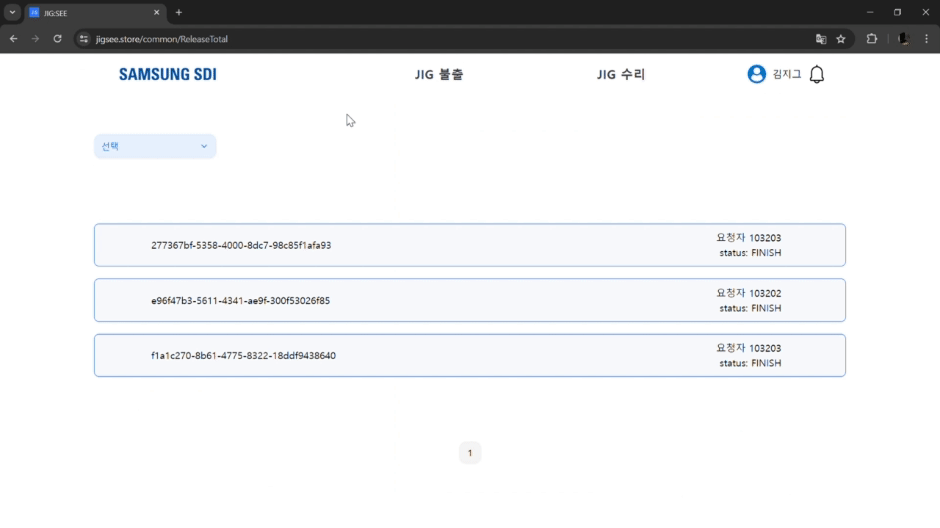

# **⚙ Jig 생애주기 관리 프로그램 - JIG:SEE ⚙**

> Samsung Software Academy For Youth 10기  
> Samsung SDI 기업 연계 프로젝트  
> 개발 기간 : 2024.04.08 ~ 2024.05.20

 

# 1. 프로젝트 배경

<strong>[배경]</strong>

제품과 직접 맞닿아있는 JIG는 제품의 품질에 큰 영향을 미칩니다.
기존 수기로 관리되고 있던 JIG는 작업자의 실수로 설비에 잘못된
JIG가 투입되는 문제가 발생할 수 있고, 보수 처리되지 않은 JIG가
다시 재투입되는 문제가 발생할 수 있습니다. 또한, 이력을 관리하기 어
려워 JIG의 Spec과 품질에 연관성을 분석하기 어렵다는 불편함이 있습니다. 이와 같은 JIG에 대한 관리를 시스템을 통해 개선하고자 합니다.

 
<strong>[목표]</strong>

- JIG 프로세스 상태에 따른 관리 기능 구현

- 품질 분석 및 이력 조회를 위한 레포트 화면 구현

- 설비 실적 인터페이스 및 제어 기능

 

# 2. 주요 기능

## 관리자 화면

### 대시보드

- 전체 Jig 현황, 예상 점검 주기, 점검 주기 별 생산량, 위험 지그 수를 한 눈에 파악할 수 있습니다.

 

### Jig 불출 요청 및 불출 승인

- 관리자가 직접 Jig의 불출을 요청할 수 있습니다.

- 불출 요청된 Jig 목록을 확인하고 승인, 반려할 수 있습니다.

- 승인이나 반려된 Jig 목록을 확인할 수 있습니다.

 

### Work Order

- Jig의 점검 항목을 수정할 수 있습니다.
- 수정된 점검 항목은 이후 작성되는 Work Order에 자동으로 반영됩니다.

 

## 기술팀 화면

### 대시보드

- 각 Jig의 상세 정보, 수리 현황을 한 눈에 볼 수 있습니다.

 

### Jig 불출 요청

- 필요한 Jig의 불출을 요청하고 요청 내역을 확인할 수 있습니다.

 

### Jig 수리 내역

- Jig의 수리 진행 내역을 조회하고 수리가 완료된 Jig의 Work Order를 작성할 수 있습니다.

 

## 생산팀 App

|                                                          |                                                           |                                                                 |
| :------------------------------------------------------: | :-------------------------------------------------------: | :-------------------------------------------------------------: |
|  |  |  |

- 생산팀은 교체 주기가 된 Jig의 목록을 확인할 수 있습니다.
- 간단하게 S/N을 촬영하고 해당 Jig를 교체할 수 있습니다.
- Jig의 잘못된 투입을 방지합니다.

 

# 3. 백엔드 기술

## K8S

## MSA

- Q1) 왜 MSA 구조를 도입했나요?
- Q2)

### 프록시 서버(API Server)

- Q1) 어떤 역할을 하나요?
- Q2) 사용한 기술이 뭔가요?

### Jig 상태 관리 서버(Jig Server)

- Q1) 어떤 역할을 하나요?
- Q2) 사용한 기술이 뭔가요?

### 회원 서버(Member Server)

- Q1) 어떤 역할을 하나요?
- Q2) 사용한 기술이 뭔가요?

### 알림 서버(Notification Server)

- Q1) 어떤 역할을 하나요?
  > Jig 불출 요청과 승인, Jig의 보수 요청 등 부서와 부서 간 요청/응답을 빠르게 확인할 수 있도록 알림을 전송합니다.  
  > 정기 점검 기간에 점검해야 할 Jig의 리스트를 사용자의 앱 푸시 알림, 이메일로 전송합니다.  
  > 알림의 전송 및 알림 내용 확인 등 알림과 관련된 모든 기능을 수행합니다.
- Q2) 사용한 기술이 뭔가요?
  > 백엔드 REST API 서버로 Spring Boot를 사용했습니다.  
  > 부서 간 요청/응답을 실시간으로 확인할 수 있도록 Server-Sent-Events를 활용했고,  
  > Replica가 3인 쿠버네티스 환경에서 SSE의 Server 의존 문제를 해결하기 위해 Redis Pub/Sub을 도입했습니다.  
  > 전송한 알림을 MySQL에 저장해 언제든지 확인할 수 있게 했습니다.  
  > 정기 점검 리스트를 앱으로 전송하기 위해 Firebase Cloud Messaging(FCM)을 사용했고, 이메일 전송은 Gmail의 SMTP 서버를 사용했습니다.

### 회원 간 요청/응답 서버(Notification-API Server)

- Q1) 어떤 역할을 하나요?
  > Jig 불출 요청과 승인, Jig의 보수 요청 등 부서와 부서 간 요청/응답 과정을 담당합니다.  
  > 요청/응답 내역의 확인을 담당합니다.
- Q2) 사용한 기술이 뭔가요?
  > 백엔드 REST API 서버로 Spring Boot를 사용했습니다.  
  > 다양한 요청/응답 내용을 저장하기 위해 NoSQL인 MongoDB를 사용했습니다.

### 주기 점검 리스트 생성 서버(Watching Server)

- Q1) 어떤 역할을 하나요?
- Q2) 사용한 기술이 뭔가요?

### 작업지시서 관리 서버(Work-Order Server)

- Q1) 어떤 역할을 하나요?
- Q2) 사용한 기술이 뭔가요?

 
 

# 4. 프로젝트 구조

## 4-1. 기술 스택

<h1>✨Front-end Stack✨</h1>

 

 

<h1>✨Back-end Stack✨</h1>

 

 

 

<h1>✨Infrastructure Stack✨</h1>

 

 

<h1>✨Cooperation Tool✨</h1>

 

## 4-2. API 명세서

 

 

 

 

 

## 4-3. ERD

### MySQL

### MongoDB

 

## 4-4. 시스템 아키텍처

- MSA 구조로 Proxy Server가 클라이언트-서버 / 서버-서버 간의 통신을 담당

 

## 4-5. 화면 정의서

 
 

# 5. 팀 구성

<table border="1" cellpadding="1" cellspacing="1" style="width:700px">
	<thead>
		<tr>
			<th scope="col" style="text-align: center;"><strong>이름</strong></th>
			<th scope="col" style="text-align: center;"><strong>역할</strong></th>
			<th scope="col" style="text-align: center;"><strong>담당</strong></th>
		</tr>
	</thead>
	<tbody>
		<tr>
			<td style="text-align: center;">주준형</td>
			<td style="text-align: center;">팀장, FE, 발표</td>
			<td>
			DnD component 제작 
            Zustand 초기 설정 
            jwt 토큰 로그인 
            프론트엔드 웹 배포 
            로그 데이터 분석
			</td>
		</tr>
		<tr>
			<td style="text-align: center;">이민지</td>
			<td style="text-align: center;">팀원, FE, UCC 제작</td>
			<td>
			Web UI 개발 
            현황판 구현 불출요청, test result 컴포넌트 구현 
            .env환경 설정
			</td>
		</tr>
		<tr>
			<td style="text-align: center;">박수형</td>
			<td style="text-align: center;">팀원, FE, 시연</td>
			<td>
			Flutter 앱 개발 
            전체적인 UI/UX 가이드 제작 
            Next.js 초기 설정 
            로그데이터 생성 
            웹 라우터 가드
			</td>
		</tr>
		<tr>
			<td style="text-align: center;">차현철</td>
			<td style="text-align: center;">팀원, BE</td>
			<td>
			회원 서버 개발 
            MSA 아키텍처 구현 
            API 명세서 및 ERD 관리
			</td>
		</tr>
		<tr>
			<td style="text-align: center;">강성범</td>
			<td style="text-align: center;">팀원, BE</td>
			<td>
			서버 개발 
            CI/CD 구축 
            쿠버네티스 구축 
            MSA 아키텍처 설계 및 구현
			</td>
		</tr>
		<tr>
			<td style="text-align: center;">김용준</td>
			<td style="text-align: center;">팀원, BE</td>
			<td>
			알림 서버, 불출 및 보수 요청/응답 서버 개발 
            CI/CD 적용 
            MySQL 및 MongoDB를 활용하여 알림 내역 저장 
            SSE, FCM, SMTP로 다양한 알림 구현
			</td>
		</tr>
	</tbody>
</table>
